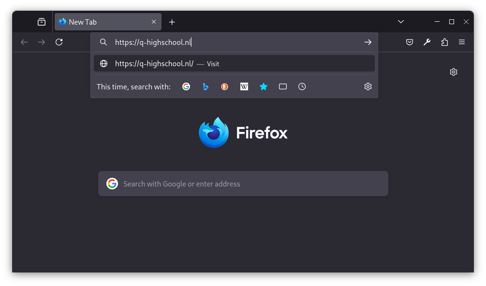
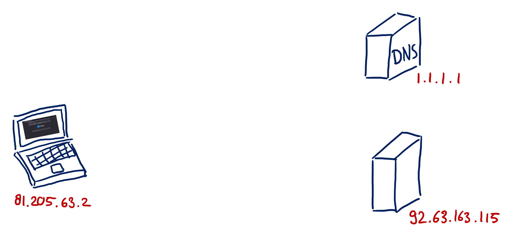
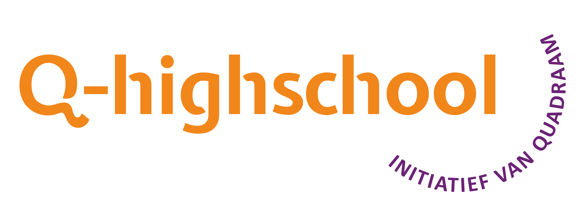

# Webdesign

Q-highschool / Bijeenkomst 1

---

## Vandaag

- Introductie
- Hoe werkt het web?
- Beginnetje HTML en CSS

***

## Doel van de module

Aan het eind van de module kun je

- een website bouwen met HTML en CSS
- een goed design voor een website bedenken en verdedigen

---

## Eindopdracht

Maak een website.

<small>(deadline: {{ eerste_inlevermoment }})</small>

---

## Syllabus

[informatica.q-highschool.nl/webdesign](../)

---

## Planning

|   | Wat? | Waar? |
|---|------|-------|
| 1 | Introductie + Hoe werkt het web? + Beginnetje HTML en CSS | Online |
| 2 | Kennismaking + Wat is goed design? + Aan de slag met HTML | Fysiek <small>tot 17:00!</small> |
| 3 | Basisregels voor goed design + Verder met HTML | Online |
| 4 | Designkritieken + Aan de slag met CSS | Fysiek |
| 5 | Wat is usability testing? + Verder met CSS | Online |
| 6 | Usability testing in de praktijk + Verder met CSS | Fysiek |
| 7 | Vragenuur + Hoe lever je dit in? + Hoe zet je een website online? | Online |
<!-- .element: style="font-size: .6em" -->

Notes:
Ook te vinden in de appsite.

***

## Hoe werkt het web?

---

### Webwoorden

Notes:
Waar denken jullie aan?

---

<!-- .slide: data-auto-animate -->

Je typt een adres, drukt op enter, en dan?



Notes:

- URL, webadres
- WWW: World wide web

---

<!-- .slide: data-auto-animate -->

Je typt een adres, drukt op enter, en dan?



Notes:

- DNS: Waar is q-highschool.nl?
  Antwoord: IP adres
- HTTP GET /
  Antwoord: 200 OK met HTML code
- HTTP GET /style.css
  Antwoord: 200 OK met CSS code
- 200 zie je niet vaak, maar 404 is wel heel bekend

<!-- ---

### Servers bekijken?

Notes:
Uitje naar BIT in Ede met Linux en Servers. Waarschijnlijk in week 6, dat zou dan 27 februari zijn. Jullie mogen ook mee! Zet het alvast met potlood in je agenda, dan houd ik jullie op de hoogte. -->

---

### Website of webapp

<div style="display: grid; grid-template-columns: 1fr 1fr;">
<div>

**Website**

Doel: informatie overbrengen

</div>
<div>

**Webapp**

App die je in je browser gebruikt

Interactief

</div>
</div>

---

### 👍 Website&nbsp;&nbsp;&nbsp;&nbsp;&nbsp;&nbsp;of&nbsp;&nbsp;&nbsp;&nbsp;&nbsp;&nbsp;webapp? ❤️

q-higschool.nl\
app.q-highschool.nl\
nl.wikipedia.org\
nos.nl\
tldraw.com\
deepl.com

Notes:

Ik zet ze één voor één in de Teams chat, antwoord daar met een reactie.

Websites maak je met HTML en CSS, voor webapps heb je JavaScript nodig. Deze module doen we websites.

Om te kopiëren:\
q-highschool.nl\
app.q-highschool.nl\
nl.wikipedia.org\
nos.nl\
tldraw.com\
deepl.com

***

## Beginnetje HTML en CSS

---

### HTML en CSS

Beschrijven samen hoe een website eruit ziet

Notes:

- Afko's: HyperText Markup Language; Cascading Style Sheets
- HTML: Structuur en opbouw
- CSS: Stijl en layout

Laat zien met F12 in de slides

---

```html
<p>
    Lorem ipsum dolor sit amet...
</p>
```
<!-- .element: style="font-size: 1em;" -->

&nbsp;

Lorem ipsum dolor sit amet... <!-- .element: class="fragment" -->

Notes:
element, start tag, end tag

---

```html
<br/>
```
<!-- .element: style="font-size: 1em;" -->

&nbsp;

Deze tekst springt `<br/>`<!-- .element: style="opacity: 0.4" --><br/>
naar een nieuwe regel
<!-- .element: class="fragment" -->

Notes:
element, empty tag -> blok zonder inhoud

---

```html
<a href="https://q-highschool.nl">
    Q-highschool
</a>
```
<!-- .element: style="font-size: 1em;" -->

&nbsp;

<a href="https://q-highschool.nl">
    Q-highschool
</a>
<!-- .element: class="fragment" -->

Notes:
element, start tag, end tag, attribuut (type " met shift)

---

```html

```
<!-- .element: style="font-size: 1em;" -->

&nbsp;

<!-- .element: class="fragment" style="max-height: 4em;" -->

Notes:
element, empty tag, 2 attributen: *s*ou*rc*e en *alt*ernatieve tekst

---

## Developer tools

- Te openen met <kbd>F12</kbd> of <kbd>Ctrl</kbd>+<kbd>Shift</kbd>+<kbd>i</kbd>

- In Safari: eerst aanzetten via *Safari* > *Instellingen* > *Geavanceerd* > *Toon Ontwikkel-menu in menubalk*
  - Daarna te vinden in *Ontwikkel* menu of via <kbd>Cmd</kbd>+<kbd>Opt</kbd>+<kbd>i</kbd>

---

## Developer tools: opdracht

<!-- .slide: style="text-align: left; font-size: .9em;" -->

Ga naar een website en beantwoord de vragen:
1. Waar staat de titel of de kop van de pagina in de HTML?
2. Welk lettertype heeft die titel?
3. Zoek een afbeelding op de pagina. Hoe staat dat in de HTML?

Pas de website aan <!-- .element: style="margin-top: 1em" -->
1. Verander de titel van de pagina in jouw naam
2. Verander het lettertype van de titel

---

## Benodigdheden

- Een moderne webbrowser
- Een editor met ondersteuning voor HTML en CSS

(Zie ook de pagina in de [syllabus](https://informatica.q-highschool.nl/webdesign).)

Notes:
Aanrader is Visual Studio Code. In de syllabus wordt nog beschreven hoe je met WebStorm werkt. Dat ga ik proberen zo snel mogelijk aan te passen, want installeren is niet eenvoudig.

---

## Aan de slag

1. Maak je benodigdheden in orde (VS Code + extensies)
2. Lees "HTML: Introductie" uit de [syllabus](https://informatica.q-highschool.nl/webdesign)
3. Maak "Oefening 1 - Simpele elementen" (opdracht 1 t/m 8) uit de [syllabus](https://informatica.q-highschool.nl/webdesign)

Notes:
Dat is het "huiswerk". Evt demonstreren hoe je een HTML bestand maakt in VS Code.
