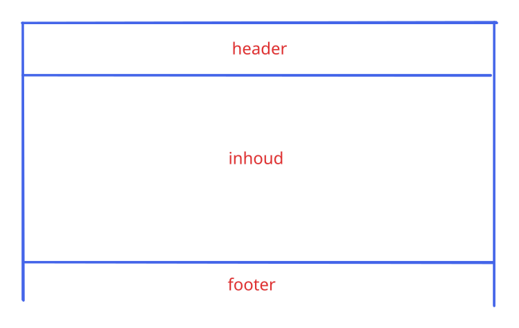
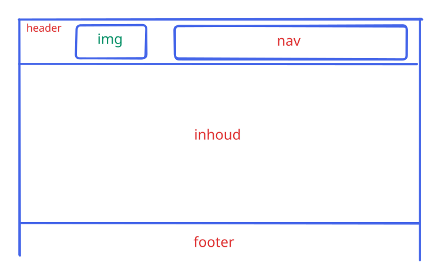
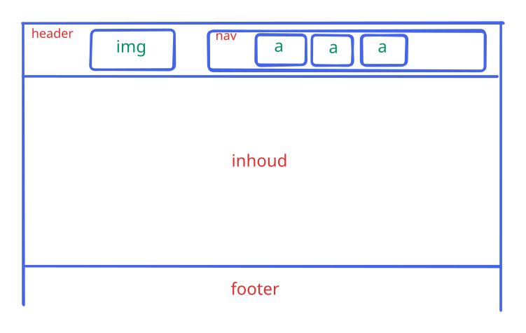
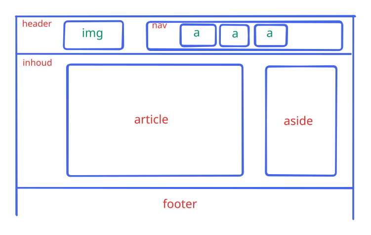
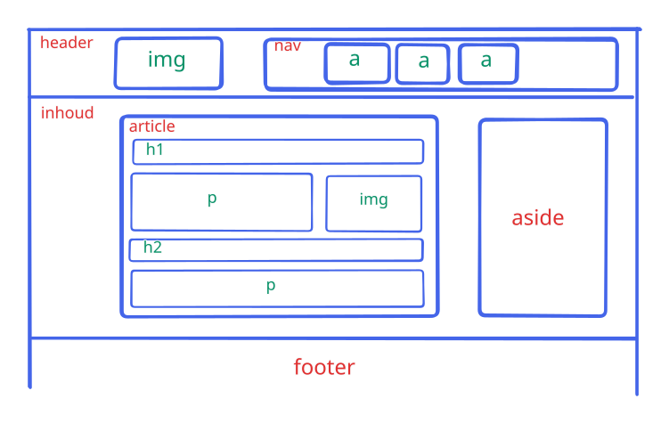
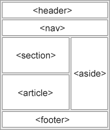
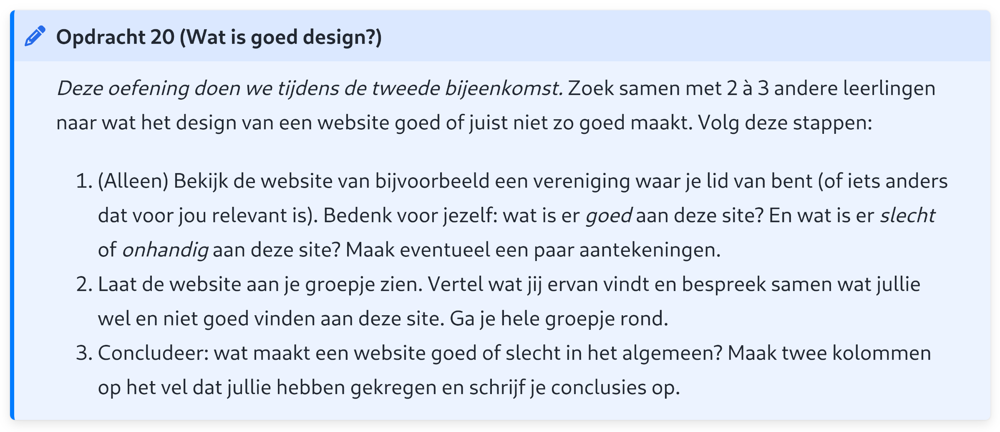

# Webdesign

Q-highschool / Bijeenkomst 2

---

## Vandaag

- Opfrisquiz over HTML + verdere introductie
- Kennismaking
- Wat is goed design?
- Aan de slag!

***

## Opfrisquiz

---

Waarvoor gebruik je HTML?

- Kleuren, lettertypes en andere "styling"
- Alleen inhoud
- Structuur, opbouw en inhoud
- Inhoud en "styling"

<!-- .element: class="mc" -->

---

Waarvoor gebruik je CSS?

- Kleuren, lettertypes en andere "styling"
- Alleen inhoud
- Structuur, opbouw en inhoud
- Inhoud en "styling"

<!-- .element: class="mc" -->

---

Wat is de *end tag* van dit element?

```html
<a href="https://q-highschool.nl">
  Q-highschool
</a>
```

- `<a href="https://q-highschool.nl">`
- `<a/>`
- `href`
- `</a>`

<!-- .element: class="mc" style="font-size: .8em" -->

---

Dit element heeft...

```html

```

- een empty tag
- een start tag en een end tag
- alleen een start tag
- alleen een end tag

<!-- .element: class="mc" -->

---

Welke attributen heeft dit element?

```html

```

- `img`, `src` en `alt`
- `img`
- `src` en `alt`
- `src`

<!-- .element: class="mc" -->

---

Waarvoor is het element `<p>`?

- Lettertype
- Kopje
- Link
- Alinea

<!-- .element: class="mc" -->

---

Waarvoor is het element `<a>`?

- Lettertype
- Kopje
- Link
- Alinea

<!-- .element: class="mc" -->

***

## Verder met HTML

---

### HTML is een blokkenstructuur

<div class="r-stack">

 <!-- .element: style="background: #fff" -->

 <!-- .element: class="fragment" style="background: #fff" -->

 <!-- .element: class="fragment" style="background: #fff" -->

 <!-- .element: class="fragment" style="background: #fff" -->

 <!-- .element: class="fragment" style="background: #fff" -->

</div>

---

### Semantic elements

<div style="display: grid; grid-template-columns: auto 1fr;">



<div>

- "Nuttige elementen"
  - `p`, `img`, `h1`, `a`, ...

- &larr; "Container"
  - Houdt andere elementen bij elkaar
  - `div`, `main`, `section`, ...

</div>

</div>

Notes:
Geef betekenis aan structuur &rarr; goed voor schermlezers, zoekmachines, AI. Ook fijn voor programmeurs!

---

### Developer tools

- Te openen met <kbd>F12</kbd> of <kbd>Ctrl</kbd>+<kbd>Shift</kbd>+<kbd>i</kbd>

- In Safari: eerst aanzetten via *Safari* > *Instellingen* > *Geavanceerd* > *Toon Ontwikkel-menu in menubalk*
  - Daarna te vinden in *Ontwikkel* menu of via <kbd>Cmd</kbd>+<kbd>Opt</kbd>+<kbd>i</kbd>

---

### Developer tools: opdracht

<!-- .slide: style="text-align: left; font-size: .9em;" -->

Ga naar een website en beantwoord de vragen:
1. Waar staat de titel of de kop van de pagina in de HTML?
2. Welk lettertype heeft die titel?
3. Zoek een afbeelding op de pagina. Hoe staat dat in de HTML?

Pas de website aan <!-- .element: style="margin-top: 1em" -->
1. Verander de titel van de pagina in jouw naam
2. Verander het lettertype van de titel

***

## Kennismaking

Notes:
- Kring, tafels aan de kant
- Namenrondje
  - Naam van de persoon naast je
- Zonder praten op volgorde staan van voornaam
  - Foto maken!
- Bingo
  - Regels:
    - Je mag een persoon maar één keer opschrijven
    - Je mag een persoon per ontmoeting maar één vraag stellen
- Bij elkaar staan:
  - Lievelingskleur
  - &rarr; Van hieruit groepjes maken voor de opdracht over design

***

## Wat is goed design?

---



Notes:
- 3-4 min voor (1)
- 3-4 min per persoon voor (2)
- 5 min voor (3)

-> Totaal 20 min

---

### Wat is goed design?

<div style="display: grid; grid-template-columns: 1fr 1fr;">
<div>

**Goed design**

</div>
<div>

**Slecht design**

</div>
</div>

***

## Aan de slag

---

### Verder deze module

- Opdrachten over HTML en CSS
- Tijdens de lessen aan de slag met design
- Eindopdracht: maak je eigen website
  - Tip: gebruik de oefeningen om alvast je eigen website op te bouwen

---

### Website maken in VS Code

Notes:
- Wie heeft het al geïnstalleerd?
- Een nieuwe map maken
- Een HTML bestand maken
- Standaard template

---

### Welke website wil je maken?

1. Wat is het doel van deze site?\
   Welke informatie wil je overbrengen?
2. Maak een blokkenstructuur van deze site\
   <small>Werk alleen of in tweetallen</small>
3. Bespreek met een andere persoon/groep:
   - Doel helder?
   - Logische indeling in blokken?
   - Geen overlappen tussen blokken?

---

### "Huiswerk"

Oefening 1 en 2 met jouw eigen blokkenstructuur

Volgende week:\
Basisregels voor goed design + Andere HTML elementen