# Webdesign

Q-highschool / Bijeenkomst 3

---

## Vandaag

- Opfrisquiz over HTML
- HTML: lijsten, tabellen, links
- Basisregels voor goed design
- Aan de slag!

***

## Opfrisquiz

---

Dit element heeft...

```html

```

- een empty tag
- een start tag en een end tag
- alleen een start tag
- alleen een end tag

<!-- .element: class="mc" -->

---

Wat zijn *semantic elements*?

- Alle elementen in HTML
- Elementen die de structuur betekenis geven
- Blokjes in de HTML om elementen te groeperen
- Elementen zoals `div` en `span`

<!-- .element: class="mc" -->

Notes:
Tweede en derde vatten allebei een deel van het goede antwoord.

---

Hoe zet je deze structuur in HTML?

<div style="display: grid; grid-template-columns: auto 1fr;">
<div>

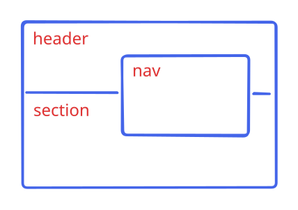

</div>
<div>

- ```html
  <header>
    <nav>
  </header>
  <section>
    </nav>
  </section>
  ```
- ```html
  <header>
    <nav />
  </header>
  <section>
  </section>
  ```
- Dat is geen valide structuur

<!-- .element: class="mc" -->

</div>
</div>

---

Waarvoor is het element `<h1>`?

- Alinea
- Titel of kopje
- Link
- Lettertype

<!-- .element: class="mc" -->

***

## HTML<br/>Lijsten, tabellen, links

---

### Tabel

<div style="display: grid; grid-template-columns: 1fr 1fr;">
<div>

```html
<table>
  <tr>
    <th>Wat?</th>
    <th>Sterren</th>
  </tr>
  <tr>
    <td>Honden</td>
    <td>*****</td>
  </tr>
  <tr>
    <td>Nakijken</td>
    <td>**</td>
  </tr>
</table>
```

</div>
<div>

<table>
  <tr>
    <th>Wat?</th>
    <th>Sterren</th>
  </tr>
  <tr>
    <td>Honden</td>
    <td>*****</td>
  </tr>
  <tr>
    <td>Nakijken</td>
    <td>**</td>
  </tr>
</table>

</div>
</div>

Notes:
- `th` table heading
- `tr` table row
- `td` table data

---

### Tabel (uitgebreid)

<div style="display: grid; grid-template-columns: 1fr 1fr;">
<div>

```html
<table>
  <caption>Reviews</caption>
  <thead>
    <tr>
      <th>Wat?</th>
      <th>Sterren</th>
    </tr>
  </thead>
  <tbody>
    <tr>
      <td>Honden</td>
      <td>*****</td>
    </tr>
    <tr>
      <td>Katten</td>
      <td>*****</td>
    </tr>
    <tr>
      <td>Nakijken</td>
      <td>**</td>
    </tr>
  </tbody>
</table>
```

</div>
<div>

<table>
  <caption>Reviews</caption>
  <thead>
    <tr>
      <th>Wat?</th>
      <th>Sterren</th>
    </tr>
  </thead>
  <tbody>
    <tr>
      <td>Honden</td>
      <td>*****</td>
    </tr>
    <tr>
      <td>Katten</td>
      <td>*****</td>
    </tr>
    <tr>
      <td>Nakijken</td>
      <td>**</td>
    </tr>
  </tbody>
</table>

</div>
</div>

Notes:
Meer structuur met

- `caption`
- `thead` en `tbody`

---

### Unordered list

<div style="display: grid; grid-template-columns: 1fr 1fr;">
<div>

```html
<ul>
  <li>Charlie</li>
  <li>Lenon</li>
  <li>Frob</li>
  <li>Nola</li>
  <li>Ollie</li>
  <li>Perry</li>
  <li>Millie</li>
  <li>Otje</li>
</ul>
```

</div>
<div>

<ul>
  <li>Charlie</li>
  <li>Lenon</li>
  <li>Frob</li>
  <li>Nola</li>
  <li>Ollie</li>
  <li>Perry</li>
  <li>Millie</li>
  <li>Otje</li>
</ul>

</div>
</div>

Notes:
- `ul` unordered list
- `li` list item

---

### Ordered list

<div style="display: grid; grid-template-columns: 1fr 1fr;">
<div>

```html
<ol>
  <li>Charlie</li>
  <li>Lenon</li>
  <li>Frob</li>
  <li>Nola</li>
  <li>Ollie</li>
  <li>Perry</li>
  <li>Millie</li>
  <li>Otje</li>
</ol>
```

</div>
<div>

<ol>
  <li>Charlie</li>
  <li>Lenon</li>
  <li>Frob</li>
  <li>Nola</li>
  <li>Ollie</li>
  <li>Perry</li>
  <li>Millie</li>
  <li>Otje</li>
</ol>

</div>
</div>

Notes:
- met `type` kun je aanpassen hoe geteld wordt
  - in dev tools: `type="I"` toevoegen voor Romeinse cijfers

---

### Links

```html
<a href="https://informatica.q-highschool.nl/webdesign">
  Syllabus
</a>
```

Notes:
- `a` anchor
- met een absolute url (begint met `https://`)

---

### Links

```html
<a href="eindopdracht.html">
  Eindopdracht
</a>
```

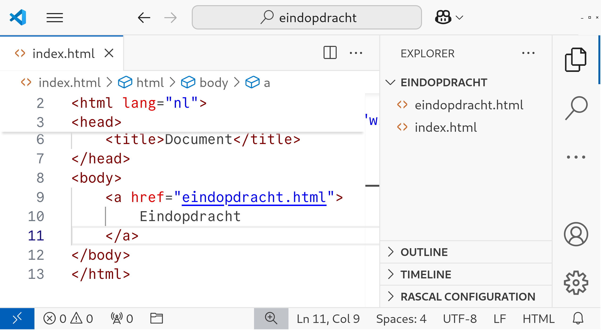

<!-- .element: class="r-stretch" -->

Notes:
- relatieve url
- als documenten naast elkaar staan
- met / &rarr; naar de root van de site

---

Deze lijst maak je met...

<div style="display: grid; grid-template-columns: 1fr 1fr;">
<div>

<ol>
  <li>Groen</li>
  <li>Blauw</li>
  <li>Paars</li>
  <li>Roze</li>
  <li>Rood</li>
</ol>

</div>
<div>

- ul
- table
- ol
- td

<!-- .element: class="mc" -->

</div>
</div>

---

Waarvoor is het element `<tr>`?

- De header-rij in een tabel
- Een cel in een tabel
- Een rij in een tabel
- Een kolom in een tabel

<!-- .element: class="mc" -->

---

Naar welke pagina gaat de link?

<small>Je bent op <https://q-highschool.nl/informatica/index.html></small>

```html
<a href="modules.html">
  Modules
</a>
```

- <https://q-highschool.nl/modules.html>
- <https://q-highschool.nl/informatica/modules.html>
- <https://modules.html>
- [modules.html](modules.html)

<!-- .element: class="mc" style="font-size: .8em;" -->

***

## Basisregels<br/>voor goed design

---

### Waarom goed design?

Je hebt een doel met je website

**en** gebruikers moeten dat doel bereiken

<!-- .element: class="fragment" -->

---

### Krug's first law of usability

"Don't make me think!" <!-- .element: class="r-fit-text" -->

---

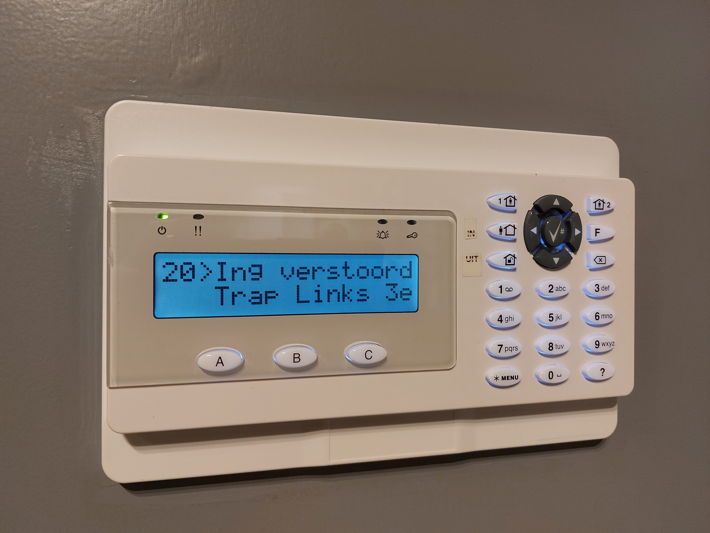

<!-- .element: class="r-stretch" -->

Notes:
Waarschijnlijk wel bekend uit Basis van CS.

Helptekst: Druk Off voor overbruggen van gebeurtenis, On voor geforceerd inschakelen, of X voor annuleren.

---

### Don't make me think

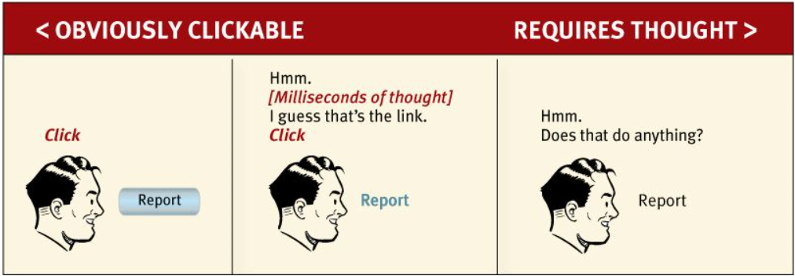

<!-- .element: class="r-stretch" -->

---

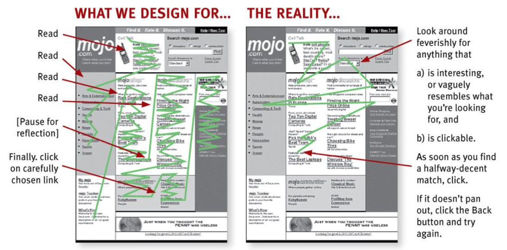

<!-- .element: class="r-stretch" -->

---

### Webgebruikers...

lezen niet,\
maar scannen een pagina <!-- .element: class="fragment" -->

maken geen weloverwogen keuzes,\
maar gaan voor "goed genoeg" <!-- .element: class="fragment" -->

zoeken niet uit hoe dingen werken,\
maar modderen door <!-- .element: class="fragment" -->

---

### Jouw website is een reclamebord

<div class="fragment">
Gebruik conventies

Creëer een visuele hiërarchie

Verdeel de pagina in duidelijke blokken

Maak duidelijk wat klikbaar is

Laat afleidingen weg

Maak je tekst scanbaar
</div>

Notes:
Design alsof iemand er op hoge snelheid langsgaat

---

<!-- TODO: deze slide kan veel beter, beetje voorbeelden -->

### Conventies

Logo linksbovenin, navigatie boven of aan de linkerkant

Elke webshop heeft een winkelmandje

Standaard icoontjes voor video's, zoeken, delen etc.

**Maar:** \
duidelijkheid over consistentie

<!-- .element: class="fragment" -->

Notes:
Iedere auto heeft van links naar rechts de koppeling, de rem en het gaspedaal. Probeer niet het wiel opnieuw uit te vinden, als dat niet per se nodig is.

Als iets veel duidelijker is, maar daardoor een beetje inconsistent, ga dan voor duidelijkheid.

---

<!-- .slide: data-auto-animate -->

### Visuele hierarchie

<div style="min-height: 500px; display: flex; flex-flow: column; justify-content: center;">

**Belangrijke dingen prominent in beeld**

<small>En de minder belangrijke dingen wat minder</small>

</div>

---

<!-- .slide: data-auto-animate -->

### Visuele hierarchie

Dingen die bij elkaar horen, staan bij elkaar

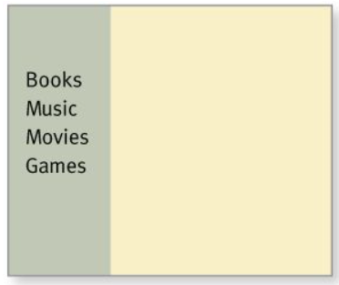 <!-- .element: height="280px" -->

---

<!-- .slide: data-auto-animate -->

### Visuele hierarchie

Nesting om aan te geven wat waar onderdeel van is

<div style="display: grid; grid-template-columns: 1fr 1fr">

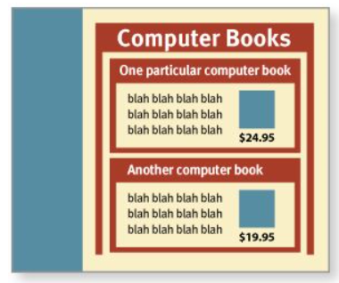 <!-- .element: height="280px" -->

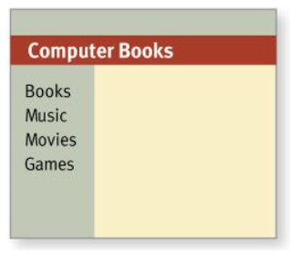 <!-- .element: height="280px" -->

</div>

---

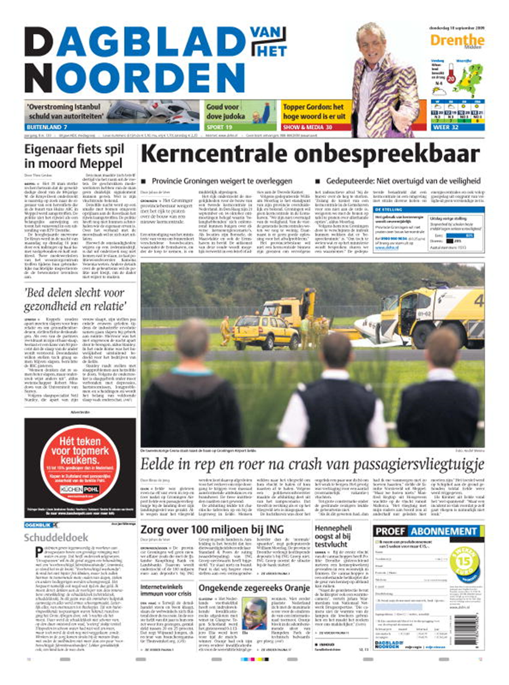 

<!-- .element: class="r-stretch" -->

Notes:
Krant uit 2009, want toen waren ze nog groot en goed gevuld.

Visuele hierarchie:
- Belangrijke dingen prominent in beeld
- Wat bij elkaar hoort, staat bij elkaar
- Geneste blokken voor onderdelen

---

### Duidelijke blokken

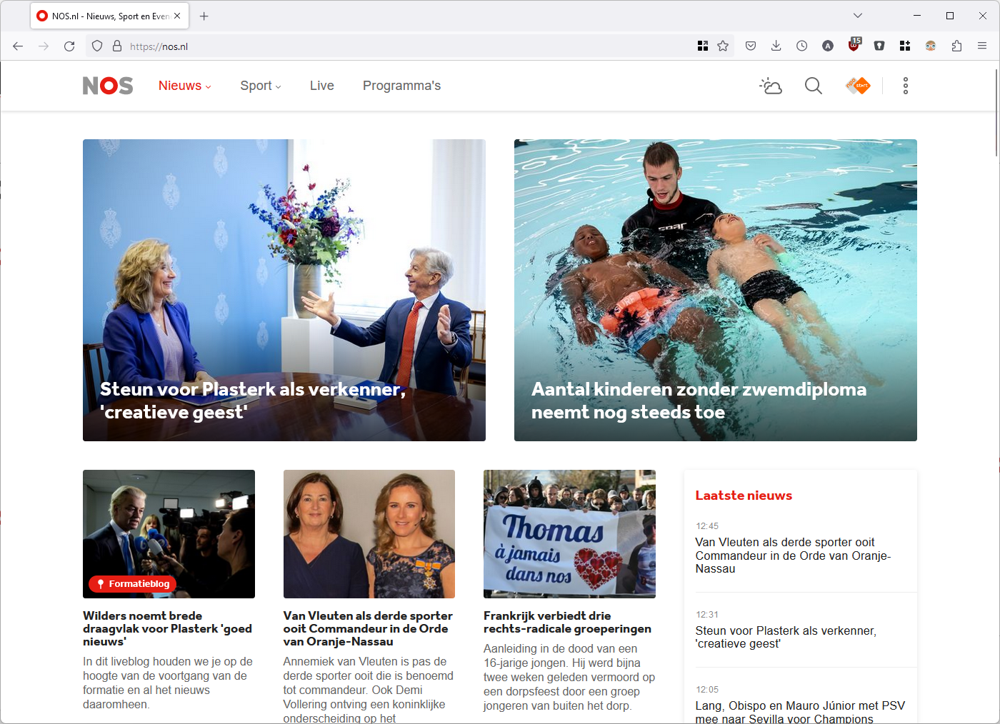 

<!-- .element: class="r-stretch" -->

Notes:
- Top stories
- Artikelen
- Nieuwsfeed

---

### Wat is klikbaar

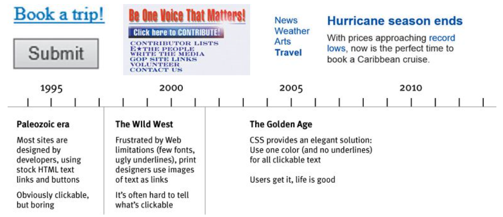 

<!-- .element: class="r-stretch" -->

---

<!-- .slide: data-background-image="assets/bijeenkomst_3/xp-background.png" data-transition="zoom" -->

### Geen afleiding

<div style="display: grid; grid-template-columns: 1fr auto;">
<div>

Geen overbodige animaties <!-- .element: class="fragment fade-right" -->

Maak het niet te druk <!-- .element: class="fragment fade-left" -->

Zorg voor structuur

<!-- .element: class="fragment fade-up" style="position: relative; left: 100px;" -->

</div>
<div>

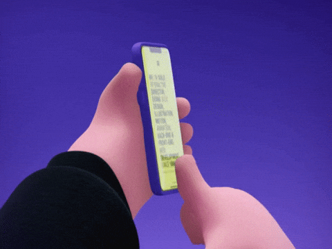

</div>
</div>

---

<!-- .slide: data-auto-animate -->

### Maak je tekst scanbaar

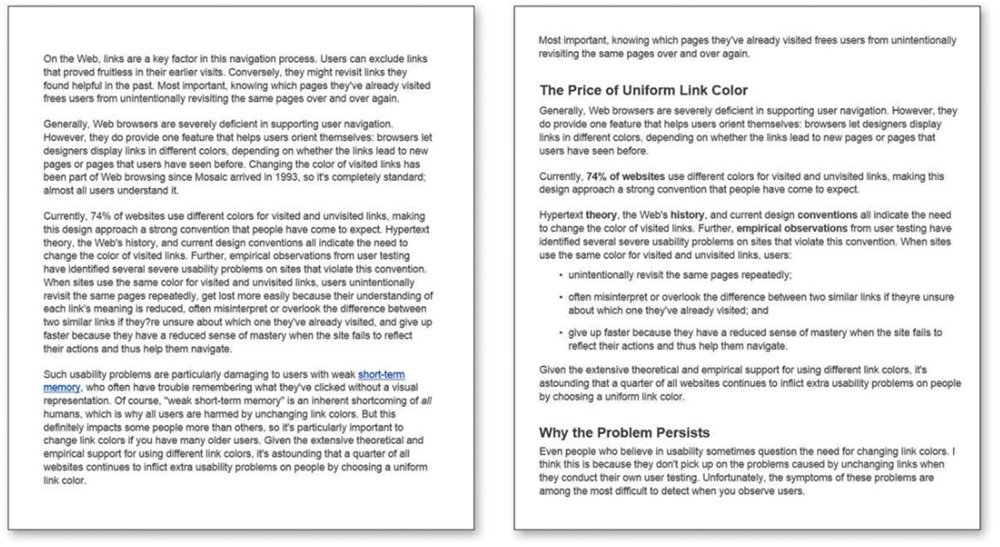

<!-- .element: class="r-stretch" -->

---

<!-- .slide: data-auto-animate -->

### Maak je tekst scanbaar

Gebruik tussenkopjes (`h1`, `h2`, `h3` etc.)

Schrijf korte alinea's <!-- .element: class="fragment" -->

Gebruik lijsten voor opsommingen <!-- .element: class="fragment" -->

**Highlight** belangrijke termen 

<!-- .element: class="fragment" -->

Notes:
Soms maar 1 zin in een alinea op websites. 100 woorden max.

---

### Jouw website is een reclamebord

Gebruik conventies

Creëer een visuele hiërarchie

Verdeel de pagina in duidelijke blokken

Maak duidelijk wat klikbaar is

Laat afleidingen weg

Maak je tekst scanbaar

***

## Aan de slag

---

### Aan de slag

Structuur van je website\
(zie vorige week)

Maak een schets van jouw website\
(mag op papier!)

Oefening 3 en 4 (tabellen en navigatie)

**Voor volgende week:** \
neem je schets mee!

<!-- .element: style="margin-top: 2em;" -->

Notes:
Volgende week weer fysieke les. Gaan we bezig met CSS en gaan we elkaars design bekijken en bespreken.
