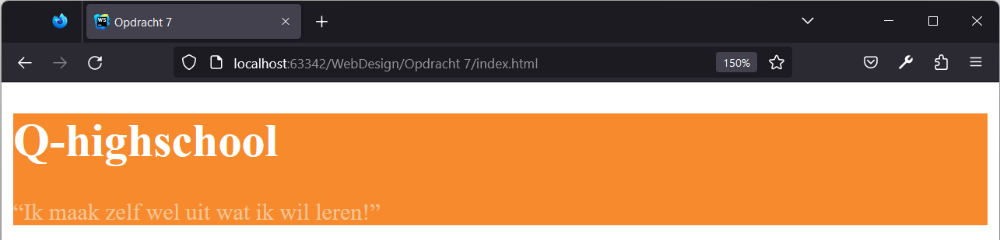
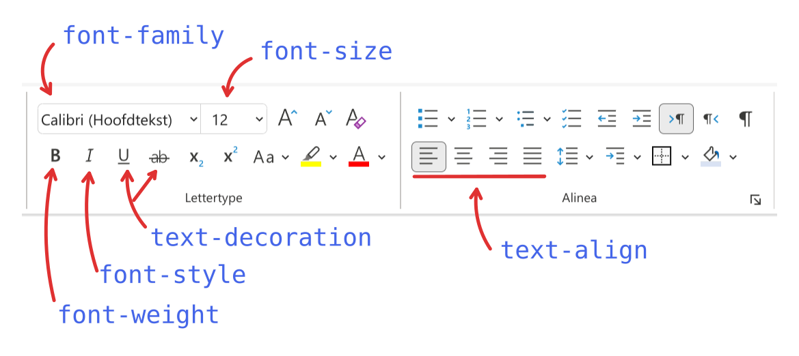
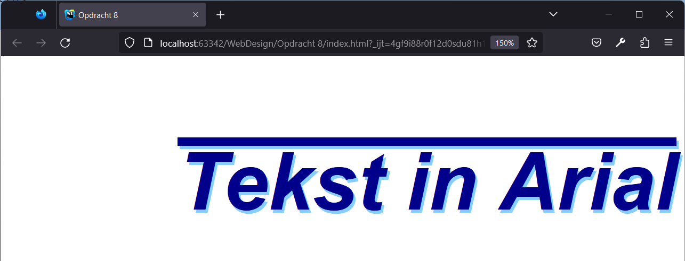

# Webdesign

Q-highschool / Bijeenkomst 4

---

## Vandaag

- Opfrisquiz
- Beginnetje met CSS
- CSS: Kleuren
- Designkritieken
- CSS: Tekst

***

## Opfrisquiz

---

Waarvoor gebruik je CSS?

- Kleuren, lettertypes en andere "styling"
- Alleen inhoud
- Structuur, opbouw en inhoud
- Inhoud en "styling"

<!-- .element: class="mc" -->

---

Deze lijst maak je met...

<div style="display: grid; grid-template-columns: 1fr 1fr;">
<div>

<ul>
  <li>Groen</li>
  <li>Blauw</li>
  <li>Paars</li>
  <li>Roze</li>
  <li>Rood</li>
</ul>

</div>
<div>

- `ul`
- `table`
- `ol`
- `td`

<!-- .element: class="mc" -->

</div>
</div>

---

Naar welke pagina gaat de link?

<small>Je bent op <https://q-highschool.nl/informatica/index.html></small>

```html
<a href="/contact.html">
  Contact
</a>
```

- <https://q-highschool.nl/contact.html>
- <https://q-highschool.nl/informatica/contact.html>
- <https://contact.html>
- [contact.html](contact.html)

<!-- .element: class="mc" style="font-size: .8em;" -->

---

Waarvoor is het element `<td>`?

- De header-rij in een tabel
- Een cel in een tabel
- Een rij in een tabel
- Een kolom in een tabel

<!-- .element: class="mc" -->

---

Waar of niet waar?

De meeste webgebruikers lezen een pagina aandachtig door, voor ze op een link klikken.

- Waar
- Niet waar

<!-- .element: class="mc grid" -->

---

Waar of niet waar?

Structuur is niet nodig op een website.

- Waar
- Niet waar

<!-- .element: class="mc grid" -->

---

Waar of niet waar?

Er is geen verschil in stijl tussen belangrijke en onbelangrijke zaken.

- Waar
- Niet waar

<!-- .element: class="mc grid" -->

***

## CSS

---

### Werken met CSS

1. Maak een bestand *style.css*
2. In de HTML code, tussen `<head>` en `</head>`:
   ```html
   <link rel="stylesheet"
         type="text/css"
         href="style.css" />
   ```
   <!-- .element: style="font-size: 1em" -->
3. Schrijf CSS code in *style.css*

---

```css
p {
  color: red;
  font-family: Arial, sans-serif;
}
```
<!-- .element: style="font-size: 1em" -->

Notes:
selector, property, waarde

1 stijlregel, 2 stijlen

---

### Selectors

- Alle elementen van een bepaalde soort
  <div class="fragment" style="display: grid; grid-template-columns: 1fr 1fr;">
  <div>

  ```html
  <p></p>
  <a></a>
  <nav></nav>
  ```

  </div>
  <div>

  ```css
  p { ... }
  a { ... }
  nav { ... }
  ```

  </div>
  </div>
- Meerdere specifieke element: *class*
  <div class="fragment" style="display: grid; grid-template-columns: 1fr 1fr;">
  <div>

  ```html
  <elem class="dingnaam">
  ```

  </div>
  <div>

  ```css
  .dingnaam { ... }
  ```

  </div>
  </div>
- Eén specifiek element: *id*
  <div class="fragment" style="display: grid; grid-template-columns: 1fr 1fr;">
  <div>

  ```html
  <elem id="hetding">
  ```

  </div>
  <div>

  ```css
  #hetding { ... }
  ```

  </div>
  </div>

<!-- .element: style="width: 80%" -->

---

Je wilt alle linkjes groen maken. Welke selector gebruik je?

<div style="display: grid; grid-template-columns: auto auto;">

```html
<body>
<header>
  
  <nav>
    <a class="navlink" href="index.html">Home</a>
    <a class="navlink" href="over_ons.html">Over ons</a>
  </nav>
</header>
<main>
  <h2>Welkom</h2>
  <p>
    Lorem ipsum dolor sit amet consectetur adipisicing elit. 
    Delectus <a href="reprehenderit.html">reprehenderit</a> 
    excepturi sunt aut distinctio earum officiis neque!
  </p>
</main>
</body>
```

<!-- .element: style="max-width: 600px; margin: 0 auto;" -->

<div>

- `.a`
- `a`
- `a.href`
- `#a`

<!-- .element: class="mc" -->

</div>
</div>

---

Je wilt de navigatielinkjes dikgedrukt maken. Welke selector gebruik je?

<div style="display: grid; grid-template-columns: auto auto;">

```html
<body>
<header>
  
  <nav>
    <a class="navlink" href="index.html">Home</a>
    <a class="navlink" href="over_ons.html">Over ons</a>
  </nav>
</header>
<main>
  <h2>Welkom</h2>
  <p>
    Lorem ipsum dolor sit amet consectetur adipisicing elit. 
    Delectus <a href="reprehenderit.html">reprehenderit</a> 
    excepturi sunt aut distinctio earum officiis neque!
  </p>
</main>
</body>
```

<!-- .element: style="max-width: 600px; margin: 0 auto;" -->

<div>

- `a.navlink`
- `#navlink`
- `.navlink`
- `navlink`

<!-- .element: class="mc" -->

</div>
</div>

Notes:
Eerste en derde allebei correct.

---

Je wilt het logo in de header in het midden zetten. Welke selector gebruik je?

<div style="display: grid; grid-template-columns: auto auto;">

```html
<body>
<header>
  
  <nav>
    <a class="navlink" href="index.html">Home</a>
    <a class="navlink" href="over_ons.html">Over ons</a>
  </nav>
</header>
<main>
  <h2>Welkom</h2>
  <p>
    Lorem ipsum dolor sit amet consectetur adipisicing elit. 
    Delectus <a href="reprehenderit.html">reprehenderit</a> 
    excepturi sunt aut distinctio earum officiis neque!
  </p>
</main>
</body>
```

<!-- .element: style="max-width: 600px; margin: 0 auto;" -->

<div>

- `#logo`
- `img`
- `.logo`
- `img.logo`

<!-- .element: class="mc" -->

</div>
</div>

***

## CSS: Kleuren

---

```css
p {
  color: darkblue;
  background-color: rgb(240, 240, 240);
  opacity: 0.4;
}
```

<!-- .element: style="font-size: 0.85em;" -->

&nbsp;

<p style="color: darkblue; background-color: rgb(240, 240, 240); opacity: 0.4;">
Lorem ipsum dolor sit amet. Jupiter deus est. In Olympo habitat.
</p>

Notes:
- `color`: kleur van de tekst
  - met een naam van een kleur
- `background-color`: kleur van de achtergrond
  - `rgb` hoeveelheid rood, groen, blauw
- `opacity`: zichtbaarheid
  - 1 volledig zichtbaar, 0 volledig doorzichtig

---

### Oefening

Download *CSS Opdrachten.zip*, zie [syllabus](https://informatica.q-highschool.nl/webdesign)

Begin bij Opdracht 7

Pas de CSS aan zodat de pagina er zo uit ziet:



***

## Designkritieken

Notes:
~ 15 min

Wie heeft een design meegenomen?

Bespreek elkaars design. Kijk nog eens naar de regels voor goed design. Wat is goed? Wat kan beter?

Geen design? Dit is het moment om daaraan te gaan werken.

***

## CSS: Tekst

---

### Tekst



<!-- .element: class="r-stretch" -->

---

### Tekst

```css
font-family: sans-serif;
```

<!-- .element: style="font-size: 1em; text-align: center;" -->

&nbsp;

### Tekst

<!-- .element: style="font-family: serif" -->

```css
font-family: serif;
```

<!-- .element: style="font-size: 1em; text-align: center;" -->

---

```css
font-size: 1em;
```

<!-- .element: style="font-size: 1em; text-align: center;" -->

```css
font-size: 2em;
```

<!-- .element: style="font-size: 2em; text-align: center;" -->

Notes:
1em is 1x standaardlettergrootte\
2em is 2x ...

---

```css
font-weight: bold; /* normal */
font-style italic; /* normal */

text-decoration: underline;
/* none, overline, line-through */
```

<!-- .element: style="font-size: 1em" -->

---

```css
text-shadow: 5px 5px red;
```

<!-- .element: style="font-size: 1em;" -->

&nbsp;

Voorbeeld

<!-- .element: style="font-size: 1.5em; text-shadow: 5px 5px red;" -->

Notes:
horizontale verschuiving, verticale verschuiving, kleur

---

```css
text-align: left;
text-align: center;
text-align: right;
text-align: justify;
```

<!-- .element: style="font-size: 1em;" -->

---

### Oefening



***

## Volgende week

Online bijeenkomst

Verder met CSS + Wat is usability testing?
