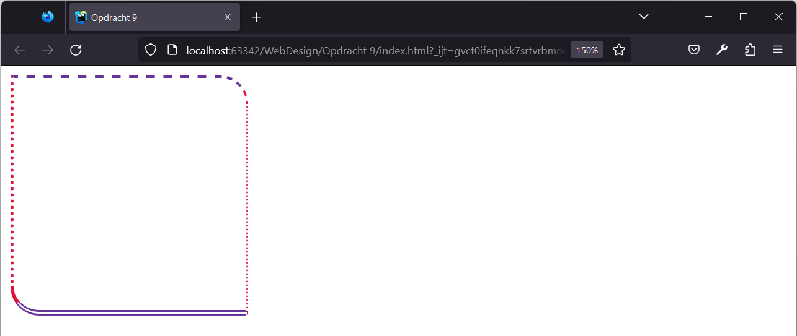
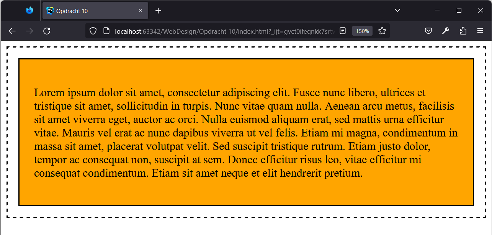

# Webdesign

Q-highschool / Bijeenkomst 5

---

## Vandaag

- Opfrisquiz
- CSS: Randen en Box model
- Usability testing

***

## Opfrisquiz

---

```css[1]
p {
  color: red;
  font-family: Arial, sans-serif
}
```

<!-- .element: style="font-size: 1em;" -->

Dit is een ...

- element
- selector
- attribuut
- property

<!-- .element: class="mc" -->

---

```html[2]

```

<!-- .element: style="font-size: 1em;" -->

Dit is een ...

- element
- selector
- attribuut
- property

<!-- .element: class="mc" -->

---

```css[2]
p {
  color: red;
  font-family: Arial, sans-serif
}
```

<!-- .element: style="font-size: 1em;" -->

Dit is een ...

- element
- selector
- attribuut
- property

<!-- .element: class="mc" -->

---

```css
#logo {
  width: 100%;
  height: 100%;
}
```

<!-- .element: style="font-size: 1em;" -->

Op hoeveel elementen is deze stijlregel van toepassing?

- Hangt van de HTML af
- 0 of 1
- 1
- 1 of meer

<!-- .element: class="mc" -->

---

`color` is de kleur van de ...

- achtergrond
- rand van het element
- tekst
- pagina

<!-- .element: class="mc" -->

---

Je wilt alle alinea's in Arial zetten. Welke selector gebruik je?

<div style="display: grid; grid-template-columns: auto auto;">

```html
<body>
<header>
  
  <nav>
    <a class="navlink" href="index.html">Home</a>
    <a class="navlink" href="over_ons.html">Over ons</a>
  </nav>
</header>
<main>
  <h2>Welkom</h2>
  <p>
    Lorem ipsum dolor sit amet consectetur adipisicing elit. 
    Delectus <a href="reprehenderit.html">reprehenderit</a> 
    excepturi sunt aut distinctio earum officiis neque!
  </p>
</main>
</body>
```

<!-- .element: style="max-width: 600px; margin: 0 auto;" -->

<div>

- `a`
- `p`
- `.p`
- `#a`

<!-- .element: class="mc" -->

</div>
</div>

---

Je wilt de navigatielinkjes dikgedrukt maken. Welke selector gebruik je?

<div style="display: grid; grid-template-columns: auto auto;">

```html
<body>
<header>
  
  <nav>
    <a class="navlink" href="index.html">Home</a>
    <a class="navlink" href="over_ons.html">Over ons</a>
  </nav>
</header>
<main>
  <h2>Welkom</h2>
  <p>
    Lorem ipsum dolor sit amet consectetur adipisicing elit. 
    Delectus <a href="reprehenderit.html">reprehenderit</a> 
    excepturi sunt aut distinctio earum officiis neque!
  </p>
</main>
</body>
```

<!-- .element: style="max-width: 600px; margin: 0 auto;" -->

<div>

- `a.navlink`
- `#navlink`
- `.navlink`
- `navlink`

<!-- .element: class="mc" -->

</div>
</div>

Notes:
Eerste en derde allebei correct.

---

Welke property bestaat niet?

- `font-family`
- `text-decoration`
- `text-style`
- `font-weight`

<!-- .element: class="mc" -->

Notes:
`text-style` bestaat niet, dat is `font-style`

---


<!-- .element: class="r-stretch" -->

***

## CSS: Randen

---

`border-style`\
`border-width`\
`border-color`\
`border-radius`

---

`border-style:`

<div style="display: grid; grid-template: auto auto / 1fr 1fr 1fr; gap: 8px; font-family: var(--r-code-font);">
<div style="border: 6px none;">none</div>
<div style="border: 6px hidden;">hidden</div>
<div style="border: 6px solid;">solid</div>
<div style="border: 6px dashed;">dashed</div>
<div style="border: 6px dotted;">dotted</div>
<div style="border: 6px double;">double</div>
</div>

---

`border-width:`

<div style="display: grid; grid-template: auto / 1fr 1fr 1fr 1fr; gap: 8px; font-family: var(--r-code-font);">
<div style="border: 1px solid;">1px</div>
<div style="border: 2px solid;">2px</div>
<div style="border: 4px solid;">4px</div>
<div style="border: 8px solid;">8px</div>
</div>

---

`border-color:`

<div style="display: grid; grid-template: auto auto / 1fr 1fr; gap: 8px; font-family: var(--r-code-font);">
<div style="border: 8px solid grey;">grey</div>
<div style="border: 8px solid #f1881c;">#f1881c</div>
<div style="border: 8px solid rgb(108, 36, 119);">rgb(108, 36, 119)</div>
<div style="border: 8px solid #00add3;">#00add3</div>
</div>

---

`border-radius:`

<div style="display: grid; grid-template: auto / 1fr 1fr 1fr 1fr; gap: 12px; font-family: var(--r-code-font);">
<div style="border: 8px solid #f1881c; border-radius: 0;">0</div>
<div style="border: 8px solid #f1881c; border-radius: 10px;">10px</div>
<div style="border: 8px solid #f1881c; border-radius: 20%;">20%</div>
<div style="border: 8px solid #f1881c; border-radius: 50%;">50%</div>
</div>

---

```css
border-style: rondom;
border-style: boven-beneden links-rechts;
border-style: boven links-rechts beneden;
border-style: boven rechts beneden links;
```

<!-- .element: style="font-size: 0.8em;" -->

&nbsp;

<div style="border-width: 6px; border-style: dashed dotted solid;" class="fragment">

`border-style: dashed dotted solid;`

</div>

Notes:
Werkt hetzelfde voor de andere properties.

---

```css
border: width style color;
```

<!-- .element: style="font-size: 1em;" -->

&nbsp;

<div style="border: 8px dashed goldenrod;" class="fragment">

`border: 8px dashed goldenrod;`

</div>

---

```css
border-top: width style color;
border-right: width style color;
border-bottom: width style color;
border-left: width style color;
```

<!-- .element: style="font-size: 1em;" -->

&nbsp;

<div style="border: 4px dotted grey; border-top: 4px solid #f1881c; border-bottom: 8px dashed black;" class="fragment">

```css
border: 4px dotted grey;
border-top: 4px solid #f1881c;
border-bottom: 8px dashed black;
```

<!-- .element: style="font-size: 1em;" -->

</div>

---

### Oefening

*CSS Opdrachten.zip* (zie [syllabus](https://informatica.q-highschool.nl/webdesign)), opdracht 9



***

## CSS: Box model

---



<!-- .element: class="r-stretch" -->

Notes:
- content: inhoud van het element
- border hebben we net gezien
- padding en margin zijn witruimte
  - binnen en buiten de rand
- margin-collapsing

---

<div style="margin: 24px; padding: 12px; border: 4px solid black; background-color: #f1881c; color: #fff;">
Dit is de inhoud van dit element.
</div>
<div style="margin: 12px; padding: 48px; border: 8px dashed black; background-color: #6c2477; color: #fff;">
Dit element heeft ook inhoud.
</div>

Notes:
Developer tools &rarr; Layout

---

```css
margin: rondom;
margin: boven-beneden links-rechts;
margin: boven links-rechts beneden;
margin: boven rechts beneden links;

margin-top: 4px;
margin-right: 0.5em;
margin-bottom: 1rem;
margin-left: 25%;
```

<!-- .element: style="font-size: 0.85em;" -->

Notes:
Vergelijkbaar met `border`; `padding` werkt precies zo.

---

### Oefening

*CSS Opdrachten.zip* (zie [syllabus](https://informatica.q-highschool.nl/webdesign)), opdracht 10



***

## Usability testing

Notes:
Waarom? Gebruikers zijn onvoorspelbaar. Wat jij maakt is logisch voor jou, maar misschien niet voor jouw gebruikers

---

Kunnen gebruikers ook echt het doel bereiken?

Waar lopen ze vast als ze het proberen?

&nbsp;

Je test niet de gebruiker maar jouw design! <!-- .element: class="fragment" -->

---

### Stap 0

Zorg voor een product om te testen

Een papieren prototype is genoeg!

---

### Stap 1

Bedenk taken voor de deelnemer

- Maak een account <!-- .element: class="fragment" -->
- Koop een product en verstuur het naar het adres van een vriend <!-- .element: class="fragment" -->
- Deel een foto met drie vrienden <!-- .element: class="fragment" -->

---

### Stap 2

Test met een deelnemer!

1. <!-- .element: class="fragment" -->
   **Welkom**: leg uit hoe de test in z'n werk gaat
2. <!-- .element: class="fragment" -->
   **Vragen**: om te hoeveel de deelnemer weet van jouw onderwerp, van websites, etc.
3. <!-- .element: class="fragment" -->
   **Homepage tour**: laat de deelnemer kijken en vraag waar ze denken dat het over gaat, wat het doel is
4. <!-- .element: class="fragment" -->
   **Taken uitvoeren**: houdt de deelnemer gefocust en laat ze hardop denken
5. <!-- .element: class="fragment" -->
   **Vragen achteraf**: bijvoorbeeld waarom de deelnemer een bepaalde keuze maakte
6. <!-- .element: class="fragment" -->
   **Afronding**: bedankt etc.

<!-- .element: style="font-size: .8em;" -->

---

### Stap 3

Bedenk wat je gaat verbeteren

Noteer de belangrijkste problemen die je bij elke deelnemer gezien hebt

---

### Papieren prototype

<iframe width="912" height="513" src="https://www.youtube-nocookie.com/embed/yafaGNFu8Eg?si=PXaq9eYsabr7YujV&amp;start=4" title="YouTube video player" frameborder="0" allow="accelerometer; autoplay; clipboard-write; encrypted-media; gyroscope; picture-in-picture; web-share" referrerpolicy="strict-origin-when-cross-origin" allowfullscreen></iframe>

***

## Reminder: Eindopdracht

Deadline: **donderdag 20 maart**

Tweede inlevermoment?\
Laat het voor **maandag 10 maart** weten!

---

## Aan de slag

- Design
  1. Maak een (papieren) prototype om mee te testen
  2. Bedenk 2 à 3 taken voor je gebruiker
- CSS: oefening 9 en 10 in jouw website

---

## Volgende week

Usability testing in de praktijk + Verder met CSS

Neem je prototype en testplan mee!
