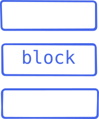
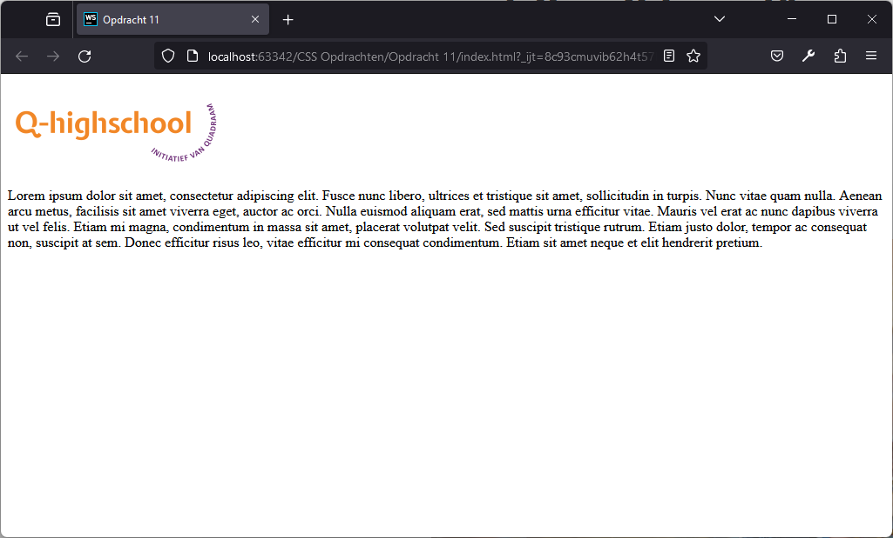
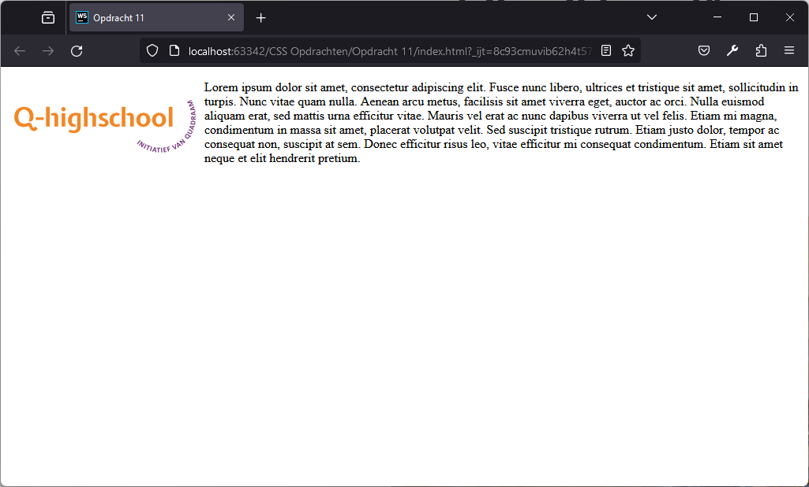
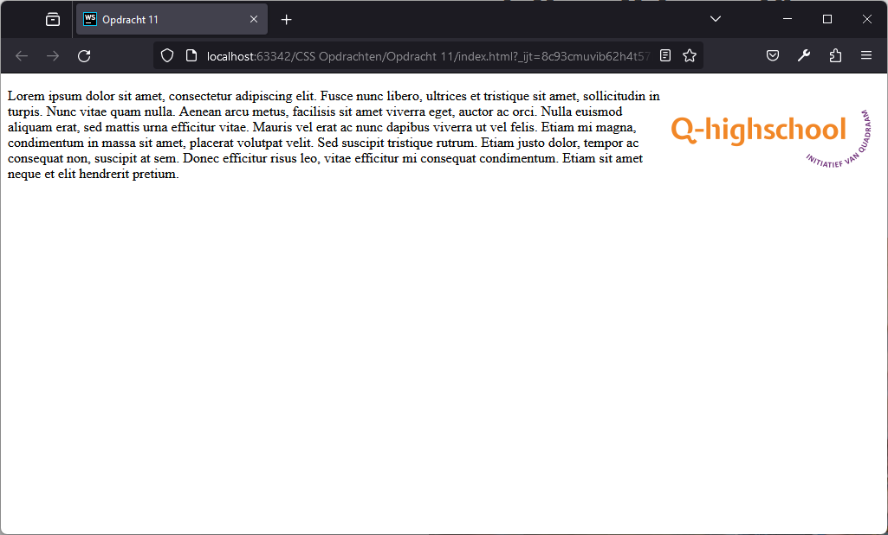

# Webdesign

Q-highschool / Bijeenkomst 6

---

## Vandaag

- Opfrisquiz
- CSS: Layouts en links
- Usability testing in de praktijk

***

## Opfrisquiz

---

Met welke property pas je het lettertype aan?

- `font-family`
- `text-decoration`
- `font-style`
- `font-weight`

<!-- .element: class="mc" -->

---

Hoe heet deze gele ruimte om het element?

<div style="display: grid; grid-template-columns: 1fr 1fr; align-items: center;">


<!-- .element: class="r-stretch" -->

- `margin`
- `border-radius`
- `padding`
- `border-width`

<!-- .element: class="mc" -->

</div>

---

Hoe heet deze paarse ruimte tussen de content en de rand?

<div style="display: grid; grid-template-columns: 1fr 1fr; align-items: center;">


<!-- .element: class="r-stretch" -->

- `margin`
- `border-radius`
- `padding`
- `border-width`

<!-- .element: class="mc" -->

</div>

---

Hoe groot is de ruimte tussen de blokken?

<div style="display: grid; grid-template-columns: auto 1fr auto; align-items: center;">
<div style="padding: 1em">

<style>
.blok {
  width: 100px;
  height: 100px;
  margin: 12px;
  background-color: #f1881c;
}
</style>

<div class="blok">A</div>
<div class="blok">B</div>

</div>
<div>

```css
.blok {
  width: 100px;
  height: 100px;
  margin: 12px;
  background-color: #f1881c;
}
```

```html
<div class="blok">A</div>
<div class="blok">B</div>
```

</div>

- `6px`
- `12px`
- `24px`
- `100px`

<!-- .element: class="mc" -->

</div>

---

Wat betekent deze stijlregel?

```css
h1 {
  margin: 1em 0;
}
```

<!-- .element: style="font-size: 1em;" -->

- `h1` links en rechts 1 pixel ruimte
- `h1` boven en onder 1 pixel ruimte
- `h1` links en rechts 1 lettergrootte ruimte
- `h1` boven en onder 1 lettergrootte ruimte

<!-- .element: class="mc" -->

---

Waarvoor is `border-radius`?

- Dikte van de rand
- Afstand tussen rand en inhoud
- Afgeronde hoeken van de rand
- Vrije ruimte binnen de straal rond het element

<!-- .element: class="mc" -->

---

Wat test je met een usability test?

- De vaardigheden van je gebruikers
- Het gebruiksgemak van jouw ontwerp
- Of de website correct werkt
- Of de website er goed uitziet in elke browser

<!-- .element: class="mc" -->

***

## CSS: Layout en links

---

### Layout

<dl>
  <dt><code>display</code></dt><dd>hoe in de flow van de pagina</dd>
  <dt><code>position</code></dt><dd>positie op de pagina</dd>
  <dt><code>float</code></dt><dd>links of rechts van lopende tekst</dd>
  <dt><code>width</code> en <code>height</code></dt><dd>breedte en hoogte</dd>
</dl>

Bonus: **flexbox** en **grid**

---

### `display`

<dl>
<dt>block</dt>
<dd>

Zoals `p`, `h1`, `ul`, `div`



<!-- .element: style="position: absolute; top: 1em; right: 1em;" -->

</dd>
<dt><code>inline</code></dt>
<dd>

Zoals `a`, `b`, `i`, `img`, `span`


</dd>
<dt><code>none</code></dt>
<dd>

Niet weergegeven (en neemt geen ruimte in)

</dd>

---

### `position`

[Demo](https://developer.mozilla.org/en-US/docs/Web/CSS/position#try_it)

| | in de flow | uit de flow |
|-|-|-|
| standaard | `static` | |
| verplaatsing | `relative` | `absolute` |
| vaste plek op scherm | `sticky` | `fixed` |

---

### `img { float: none; }`



<!-- .element: class="r-stretch" -->

---

### `img { float: left; }`



<!-- .element: class="r-stretch" -->

---

### `img { float: right; }`



<!-- .element: class="r-stretch" -->

---

### Bonus: Grid

<div style="display: grid; grid-template-columns: 2fr 1fr; align-items: center;">

```css
.box {
  display: grid;
  grid-template-columns: 1fr 1fr;
  grid-template-rows: 100px 100px;
}

p {
  border: 4px solid #f1881c;
}
```

```html
<div class="box">
  <p>1</p>
  <p>2</p>
  <p>3</p>
  <p>4</p>
</div>
```

<div style="border: 2px solid black; padding: 12px; grid-column: span 2; display: grid; grid-template-columns: 1fr 1fr; grid-template-rows: 100px 100px;">
  <p style="border: 4px solid #f1881c;">1</p>
  <p style="border: 4px solid #f1881c;">2</p>
  <p style="border: 4px solid #f1881c;">3</p>
  <p style="border: 4px solid #f1881c;">4</p>
</div>

<div>

---

### Bonus: Grid

[CSS Tricks: CSS Grid Layout Guide](https://css-tricks.com/snippets/css/complete-guide-grid/)

---

### Bonus: Flexbox

<div style="display: grid; grid-template-columns: 2fr 1fr; align-items: center;">

```css
.box {
  display: flex;
  justify-content: space-between;
}

p {
  border: 4px solid #f1881c;
}
```

```html
<div class="box">
  <p>1</p>
  <p>2</p>
  <p>3</p>
  <p>4</p>
</div>
```

<div style="border: 2px solid black; padding: 12px; grid-column: span 2; display: flex; justify-content: space-between;">
  <p style="border: 4px solid #f1881c;">1</p>
  <p style="border: 4px solid #f1881c;">2</p>
  <p style="border: 4px solid #f1881c;">3</p>
  <p style="border: 4px solid #f1881c;">4</p>
</div>

<div>

---

### Bonus: Flexbox

[CSS Tricks: CSS Flexbox Layout Guide](https://css-tricks.com/snippets/css/a-guide-to-flexbox/)

---

### Links

```css[1|2|3|4]
a:link { ... }
a:visited { ... }
a:hover { ... }
a:active { ... }
```

<!-- .element: style="font-size: 1em" -->

&nbsp;

[Demo link](#)

Notes:
- `link` &rarr; standaard
- `visited` &rarr; al een keer bezocht
- `hover` &rarr; muis over
- `active` &rarr; muisknop ingedrukt

Demo met dev tools

---

### Aan de slag

Nog geen design prototype? &rarr; Ga die maken!

*CSS Opdrachten.zip* (zie [syllabus](https://informatica.q-highschool.nl/webdesign)), opdracht 11/12


Notes:
Wie heeft er een (papieren) prototype meegenomen?

***

## Usability testing

Kunnen gebruikers ook echt het doel bereiken?

Waar lopen ze vast als ze het proberen?

&nbsp;

Je test niet de gebruiker maar jouw design! <!-- .element: class="fragment" -->

---

### Aan de slag

- Voer een usability test uit volgens het stappenplan
  - Neem 10-15 minuten
  - Wissel na de eerste test van rol</small>
- <!-- .element: class="fragment" --> Klaar?
  1. Bedenk: wat ga je verbeteren?
  2. Verbeter je prototype
  3. Verwerk dat in je eindopdracht
  4. Ga verder met Opdracht 11/12

Notes:
Dus twee rondes: eerst test je jouw site, daarna ben je deelnemer (of andersom)

***

## Na de vakantie

Laatste bijeenkomst, online

Opdracht 11/12 bespreken\
Vragenuur\
Hoe lever je dit in?\
Hoe zet je dit online? (Als je dat wilt.)
