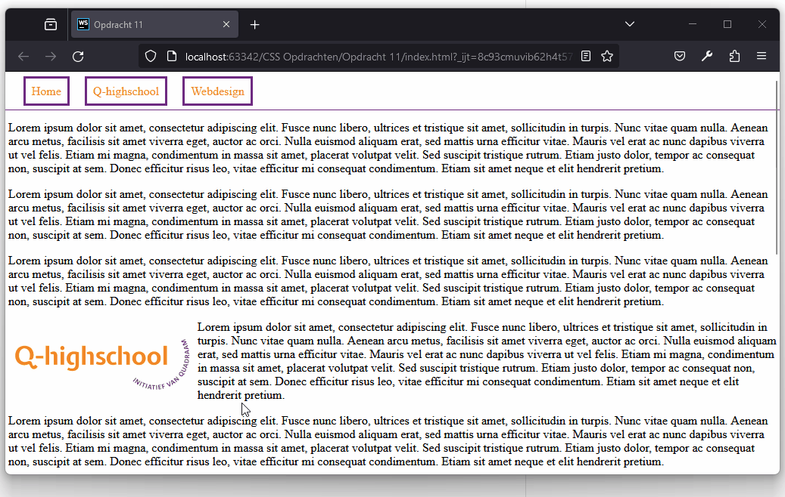

# Webdesign

Q-highschool / Bijeenkomst 7

---

## Vandaag

Laatste bijeenkomst!

- Opfrisquiz
- Opdracht 11/12 bespreken
- Hoe lever je dit in?
- Hoe zet je dit online? (Als je dat wilt.)
- Vragenuur

***

## Opfrisquiz

---

Waarvoor gebruik je HTML?

- Kleuren, lettertypes en andere "styling"
- Alleen inhoud
- Structuur, opbouw en inhoud
- Inhoud en "styling"

<!-- .element: class="mc" -->

---

Waarvoor gebruik je CSS?

- Kleuren, lettertypes en andere "styling"
- Alleen inhoud
- Structuur, opbouw en inhoud
- Inhoud en "styling"

<!-- .element: class="mc" -->

---

Welke attributen heeft dit element?

```html

```

- `img`, `src` en `alt`
- `img`
- `src` en `alt`
- `src`

<!-- .element: class="mc" -->

---

Wat zijn *semantic elements*?

- Alle elementen in HTML
- Elementen die de structuur betekenis geven
- Blokjes in de HTML om elementen te groeperen
- Elementen zoals `div` en `span`

<!-- .element: class="mc" -->

Notes:
Tweede en derde vatten allebei een deel van het goede antwoord.

---

Waarvoor is het element `<a>`?

- Lettertype
- Kopje
- Link
- Alinea

<!-- .element: class="mc" -->

---

Naar welke pagina gaat de link?

<small>Je bent op <https://q-highschool.nl/informatica/index.html></small>

```html
<a href="modules.html">
  Modules
</a>
```

- <https://q-highschool.nl/modules.html>
- <https://q-highschool.nl/informatica/modules.html>
- <https://modules.html>
- [modules.html](modules.html)

<!-- .element: class="mc" style="font-size: .8em;" -->

---

Deze lijst maak je met...

<div style="display: grid; grid-template-columns: 1fr 1fr;">
<div>

<ul>
  <li>Groen</li>
  <li>Blauw</li>
  <li>Paars</li>
  <li>Roze</li>
  <li>Rood</li>
</ul>

</div>
<div>

- `ul`
- `table`
- `ol`
- `td`

<!-- .element: class="mc" -->

</div>
</div>

---

```css[1]
p {
  color: red;
  font-family: Arial, sans-serif
}
```

<!-- .element: style="font-size: 1em;" -->

Dit is een ...

- element
- selector
- attribuut
- property

<!-- .element: class="mc" -->

---

Je wilt alle alinea's in Arial zetten. Welke selector gebruik je?

<div style="display: grid; grid-template-columns: auto auto;">

```html
<body>
<header>
  
  <nav>
    <a class="navlink" href="index.html">Home</a>
    <a class="navlink" href="over_ons.html">Over ons</a>
  </nav>
</header>
<main>
  <h2>Welkom</h2>
  <p>
    Lorem ipsum dolor sit amet consectetur adipisicing elit. 
    Delectus <a href="reprehenderit.html">reprehenderit</a> 
    excepturi sunt aut distinctio earum officiis neque!
  </p>
</main>
</body>
```

<!-- .element: style="max-width: 600px; margin: 0 auto;" -->

<div>

- `a`
- `p`
- `.p`
- `#a`

<!-- .element: class="mc" -->

</div>
</div>

---

`color` is de kleur van de ...

- achtergrond
- rand van het element
- tekst
- pagina

<!-- .element: class="mc" -->

---

Met welke property pas je het lettertype aan?

- `font-family`
- `text-decoration`
- `font-style`
- `font-weight`

<!-- .element: class="mc" -->

---

Hoe heet deze gele ruimte om het element?

<div style="display: grid; grid-template-columns: 1fr 1fr; align-items: center;">



<!-- .element: class="r-stretch" -->

- `margin`
- `border-radius`
- `padding`
- `border-width`

<!-- .element: class="mc" -->

</div>

---

Hoe stel je deze padding in?



<!-- .element: class="r-stretch" -->

- `padding: 4px 2px;`
- `padding: 4px 4px 2px;`
- `padding: 4px 2px 4px 4px;`
- `padding: 4px 4px 2px 4px;`

<!-- .element: class="mc" -->

---

Waarvoor is `border-radius`?

- Dikte van de rand
- Afstand tussen rand en inhoud
- Afgeronde hoeken van de rand
- Vrije ruimte binnen de straal rond het element

<!-- .element: class="mc" -->

---

Wat test je met een usability test?

- De vaardigheden van je gebruikers
- Het gebruiksgemak van jouw ontwerp
- Of de website correct werkt
- Of de website er goed uitziet in elke browser

<!-- .element: class="mc" -->

***

*CSS Opdrachten.zip* (zie [syllabus](https://informatica.q-highschool.nl/webdesign)), opdracht 11/12



***

## Hoe lever je dit in?

[Syllabus: Eindopdracht > Inleveren](https://informatica.q-highschool.nl/webdesign/2425-3/eindopdracht.html#inleveren)

***

## En verder?

Q-highschool:\
Programmeren met JavaScript, Python+

***

## Hoe zet je dit online?

---


<!-- .element: class="r-stretch" -->

---

Gratis opties: GitHub Pages, Neocities, ...

Hoe? Zie de [syllabus](https://informatica.q-highschool.nl/webdesign/2425-3/online_zetten.html)

Notes:
- GitHub Pages gebruiken we voor de syllabussite
- Neocities is een soort sociaal medium voor websites
- En nog vele meer, bijv Cloudflare Pages, Netlify

---

Een eigen domein?

Notes:
- Kost per jaar, zeg €10-€15 voor standaarddomeinen
  - Let op voor "eerste jaar" deals
- Vaak een combinatie met webhosting en email mogelijk

***

## Vragenuur

Over

iets wat je nog niet helemaal begrijpt\
iets wat we niet besproken hebben\
hoe je iets in je website kunt doen\
hoe we de syllabussite maken\
hoe ik mijn eigen website maak\
static site generators\
CMS, DNS, HTTPS of andere afko's\
webservers\
...
