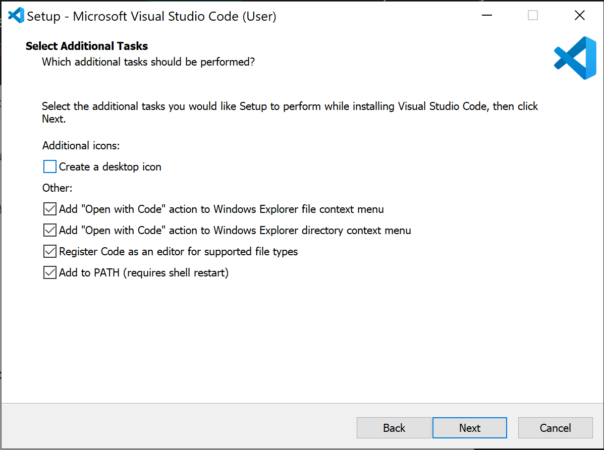

# Benodigdheden

Om deze module goed te kunnen volgen, heb je de volgende programma's nodig:

## Browser
- Een moderne webbrowser, zoals [Chrome](https://www.google.com/chrome/) (of een van de andere Chromium browsers, zoals [Edge](https://www.microsoft.com/edge), [Vivaldi](https://vivaldi.com/), [Opera](https://www.opera.com/) of [Brave](https://brave.com/)), [Firefox](https://www.mozilla.org/firefox/new/) of [Safari](https://www.apple.com/safari/). Internet Explorer of WebKit browsers anders dan Safari raden we af, omdat deze browsers niet altijd goed met moderne HTML en CSS versies overweg kunnen.

## Editor
Een editor met ondersteuning voor HTML en CSS. We raden *Visual Studio Code* aan en werken eraan om de syllabus te herschrijven met de juiste commando's daarvoor.

Visual Studio Code kun je installeren vanaf [hun website](https://code.visualstudio.com/) en de installatie spreekt redelijk voor zich. De meeste standaard-opties zijn prima, maar het is aan te raden om ook de *Add 'Open with Code' action to Windows Explorer ...* opties aan te vinken.

  

## Live Server installeren (VS Code)
Wanneer je geschreven code wil bekijken in je browser, dan kun je in Visual Studio Code een plugin schrijven, die dat automatisch voor je regelt. Er komt dan heel tijdelijk een echte webserver te draaien op je computer.

1. Open **Visual Studio Code**.
2. Ga naar **Extensions** (⌘⇧X op macOS / Ctrl+Shift+X op Windows).
3. Zoek **“Live Server”** en installeer de extensie van **Ritwick Dey**  
   (ID: `ritwickdey.LiveServer`).
4. Herstart VS Code als daarom wordt gevraagd.

**Gebruiken**
- (Als je dit nog niet gedaan hebt)
  Open je websitemap in VS Code (**Bestand → Map openen…**).
- Open `index.html` en kies **Open with Live Server** (rechtermuisknop),  
  of klik **Go Live** rechtsonder.
- De site opent op `http://localhost:5500`. Wijzigingen verschijnen na **Opslaan** van je bestand.
- Stoppen: klik opnieuw op **Go Live** (of op de poort-indicator).