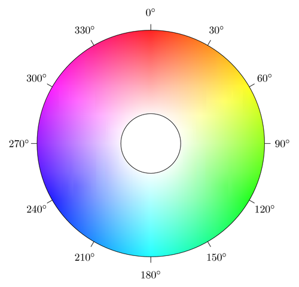

# Oefening 7 - Kleuren

Eén van de belangrijkste elementen van een website is het kleurenschema. Tot nu toe zijn onze websites in zwart-wit gemaakt op een paar plaatjes na. Wij gaan daar nu verandering in aanbrengen met CSS.

## Tekst

Je kan met CSS de kleur van tekst heel eenvoudig veranderen, dit doe je met de stijlregel: `color: kleur;`

Hierbij kan `kleur` veel verschillende waarden zijn. De simpelste optie is het gebruiken van de Engelse naam voor de kleur (bijvoorbeeld `red` of `yellow`). Wanneer je achter `color:` op *CTRL*+*SPATIE* drukt, krijg je binnen WebStorm een lijstje te zien van alle kleuren die mogelijk zijn. Er zijn 140 standaard kleuren die je kan gebruiken. De lijst is ook nog terug te vinden op: [*https://www.w3schools.com/colors/colors_names.asp*](https://www.w3schools.com/colors/colors_names.asp) . Alle tekst binnen paragrafen blauw maken doe je zo:

``` css
    p {
        color: blue;
    }
```

1.  Geef de tekst in je website een kleurtje. Maak hierbij gebruik van aparte kleuren voor de verschillende kopjes, tabellen, etc.

## (Optioneel) RGB(A)

De Engelse naam voor de kleur gebruiken, is niet de enige manier om de kleur te bepalen, een andere manier is om de zogenaamde RGB Value te gebruiken. Hierbij staan de letters in RGB voor Red, Green en Blue. De syntax voor een RGB kleur is als volgt: `color: rgb(255,255,255);`

In deze syntax staat het eerste getal voor de hoeveelheid rood, het tweede getal voor de hoeveelheid groen en het derde getal voor de hoeveelheid blauw. Deze getallen kunnen waarden zijn tussen 0 en 255, waarbij 0 betekent dat die kleur er niet in zit en 255 betekent dat die kleur er zo veel mogelijk in zit. Met RGB kleuren kun je de verschillende waarden voor rood, groen en blauw licht combineren om zo tot meer kleuren te komen. Hiervoor kan je het beste een color picker gebruiken zoals die van google, zo kan je visueel een kleur kiezen en dan de RGB waarden te kopiëren: [*https://www.google.com/search?q=rgb+color+picker*](https://www.google.com/search?q=rgb+color+picker)

RGBA is een variant op de RGB waarden. Hierbij is er een vierde getal toegevoegd tussen 0 en 1 dat bepaald hoe transparant de kleur is. Hier betekent 0 dat de kleur volledig transparant is en 1 dat de kleur niet transparant is. De syntax hiervan is als volgt: `color: rgba(255,255,255,0.5);`

1.  Pas één of meerdere van jouw aangepaste kleuren aan en gebruik nu RGB of RGBA waarden.

## (Optioneel) HEX

De HEX manier om kleuren aan te geven lijkt veel op de RGB manier. De syntax is als volgt: `color: #ff155a;`

Op het eerste oog lijkt het heel anders, dit komt door het gebruik van hexadecimal. Hexadecimal is een manier om te tellen die voor computers is ontwikkeld. De waardes voor rood, groen en blauw blijven variabel tussen 0 en 255, alleen dit ziet er in hexadecimal uit als `00` tot `ff`. Dit betekent dat in het voorbeeld `ff` de waarde is voor rood, `15` de waarde is voor groen en `5a` de waarde is voor blauw. Ook het gebruik van HEX is het makkelijkst met de color picker, kies een kleur en kopieer de waarde: <https://www.google.com/search?q=rgb+color+picker>

1.  Pas één of meerdere van jouw aangepaste kleuren aan en gebruik nu HEX waarden.

## (Optioneel) HSL(A)

Nog een andere manier om kleuren aan te duiden is HSL. Dit staat voor Hue, Saturation en Lightness. De syntax is als volgt: `color: hsl(360, 100%, 100%);`



Hierbij staat het eerste getal voor de hue (tint in het Nederlands). Deze hue is een waarde tussen 0° en 360° op het kleurenwiel hierboven. Als je de hue van 0 tot 360 laat variëren doorloop je de kleuren van de regenboog. Het tweede getal staat voor de saturation (verzadiging in het Nederlands). Deze saturation is een waarde tussen 0% en 100%. Hierbij is 100% een hele hoge verzadiging en dus hele levendige, felle en heldere kleuren. 0% is een hele lage verzadiging en is daarom heel grauw. Het derde getal staat voor lightness (helderheid in het Nederlands). Deze lightness is ook een waarde tussen 0% en 100%. Hierbij is 100% een hele hoge helderheid en dus wit. 0% is een hele lage helderheid en dus zwart. De color picker is ook hierbij je beste vriend: <https://www.google.com/search?q=rgb+color+picker>

HSLA is weer een variant op de HSL waarden. Net zoals bij RGBA is er een vierde getal toegevoegd tussen 0 en 1 dat bepaald hoe transparant de kleur is. Hierbij betekent 0 dat de kleur volledig transparant is en 1 dat de kleur niet transparant is.

1.  Pas één of meerdere van jouw aangepaste kleuren aan en gebruik nu HSL of HSLA waarden.

## Achtergrond

Naast de tekstkleur kan ook de achtergrondkleur van elementen aangepast worden. Dit wordt gedaan met `background-color`. Hierbij kunnen de verschillende waarden voor kleuren hierboven weer gebruikt worden. Deze property heeft op ieder element weer een andere invloed, uitproberen loont dus.

1.  Voeg een achtergrondkleur toe aan één of meerdere elementen.

## Opacity

Voor ieder element in je webpagina kan je ook `opacity` gebruiken. Dit specificeert de doorzichtigheid van dat element. De waarde hiervan moet tussen 0 en 1 zijn, waarbij 0 betekent dat het element niet zichtbaar is en 1 betekent dat het element volledig zichtbaar is.

1.  Voeg `opacity` toe aan één of meerdere elementen.
2.  Zorg ervoor dat in je uiteindelijke CSS-bestand iedere kleuraanduiding minimaal één keer aanwezig is. Zo kan je later terugkomen naar de code en zien welke verschillende manieren ook alweer bestaan.
