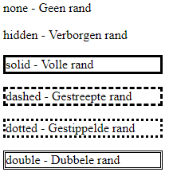

# Oefening 9 - Randen

Met `CSS` is het mogelijk om randen te vormen om ieder element van je website. Randen zijn een essentieel onderdeel van je webdesign, ze zorgen er namelijk voor dat de lezer van je website makkelijk kan zien hoe alles georganiseerd is. Het verbetert op die manier de User Experience.

## Border-style

Randen zijn er in allerlei verschillende vormen en met `border-style` kan je bepalen welke vorm je rand moet aannemen. `border-style` kan tussen de één en vier parameters bevatten met de volgende syntax:

``` css
border-style: rondom;
border-style: boven-beneden links-rechts;
border-style: boven links-rechts beneden;
border-style: boven rechts beneden links;
```

Bijvoorbeeld:

``` css
border-style: dotted;
border-style: dotted dotted;
border-style: dotted dotted dotted;
border-style: dotted dotted dotted dotted;
```



Een paar van de verschillende waarden staan aan de rechterkant, kijk voor meer mogelijkheden voor randstijlen op *<https://www.w3schools.com/css/css_border.asp> *

*LET OP!* `border-style` *moet gebruikt worden als je één van de andere waarden van randen die hierna worden uitgelegd wilt gebruiken. Wanneer je dit niet toevoegt dan gebeurt er niks!*

1.  Voeg een `border-style` toe aan één of meerdere elementen naar keuze.

## Border-width

Je kunt de dikte van de randen aanpassen met `border-width`. Dit kan in px, pt, cm, em, thin, medium of thick. Ook `border-width` kan tussen de één en vier parameters bevatten met de syntax van `border-style`

1.  Voeg een `border-width` toe aan de elementen met een rand.

## Border-color

Je kunt de kleur van de randen ook aanpassen. Dit doe je met `border-color`. Dit kan met de verschillende manieren om kleuren weer te geven uit Opdracht 7. Ook `border-color` kan tussen de één en vier parameters bevatten met de syntax van `border-style`. Wanneer er geen border-color is gespecificeerd dan volgt de rand de kleur van het element die is gepaald met `color`.

1.  Voeg een `border-color` toe aan de elementen met een rand.

## Border-radius

Tot nu toe hebben de randen steeds vierkante hoeken, je kan echter met `border-radius` ook ronde hoeken specificeren. Dit bepaalt de radius van de cirkels op de hoeken en heeft een maximum van 12px. Ook `border-radius` kan tussen de één en vier parameters bevatten, waarbij er met vier parameters linksboven begonnen wordt en met linksonder geëindigd wordt.

1.  Voeg een `border-radius` toe aan één of meer elementen met een rand.

## Border

Voor simpele randen die geen verschil nodig hebben in de verschillende zijden kan je `border` gebruiken. De syntax is als volgt: `border: border-width border-style border-color`

1.  Pas een simpele rand aan en vervang de CSS code met een `border`
