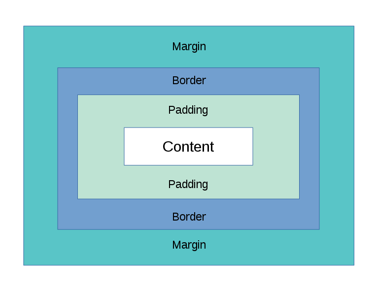

# Opdracht 10 - Het box model



Alle HTML-elements kunnen in principe gezien worden als dozen. In CSS wordt **het box model** gebruikt om het design en de layout van de elements te bespreken. Het box model is een doos die om het element heen zit bestaande uit de margin, border en padding. Dit zit om de content heen die door de HTML wordt bepaald. Met borders heb je al kennis gemaakt, nu ga je ook kennismaken met margin en padding.

## Margin

De margin van een element is de ruimte die om de border heen zit die het element bezet. Binnen deze margin kunnen zich normaal gesproken geen andere elements bevinden. Margin is te bepalen met de volgende syntax `margin: boven rechts beneden links;` of:

``` css
margin-top: waarde;
margin-right: waarde;
margin-bottom: waarde;
margin-left: waarde;
```

De margin kan verschillende waarden hebben:

-   auto: de browser berekend de goede margin
-   px, pt, cm, etc.
-   %: een percentage van de breedte van het element dat eromheen zit
-   inherit: dezelfde margin als het element dat eromheen zit

Margins zijn bedoeld om een minimale hoeveelheid ruimte aan één of meer van de zijden van een element te definiëren. Om dit te faciliteren, maakt de browser gebruik van *margin collapsing*. Dit houdt in dat wanneer er twee margins boven elkaar zitten van verschillende elementen, de kleinste margin genegeerd wordt. Het resultaat is dus dat de afstand tussen de elements slechts de afstand van de grootste margin is, en niet de som van beide margins.

1.  Pas de `margin` aan van één of meerdere elementen.

## Padding

Padding is eigenlijk het omgekeerde van een margin. Een margin bepaald de ruimte tussen de border en andere elementen, terwijl de padding de ruimte tussen de border en de content bepaalt. Padding volgt dezelfde syntax als margin.

1.  Pas de `padding` aan van één of meerdere elementen.
