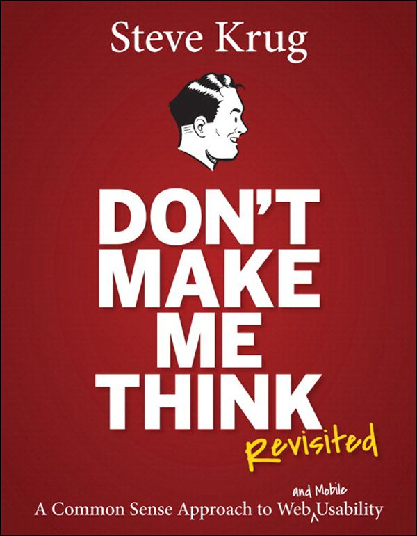
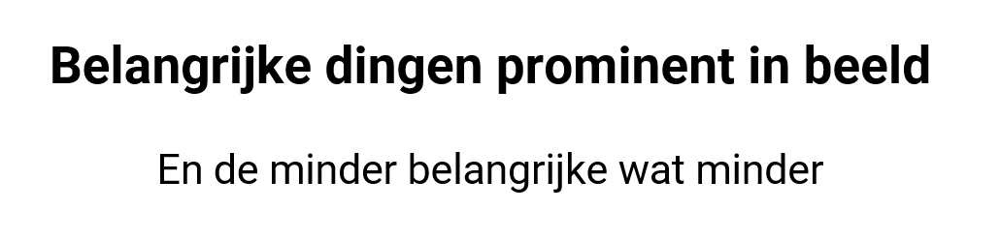
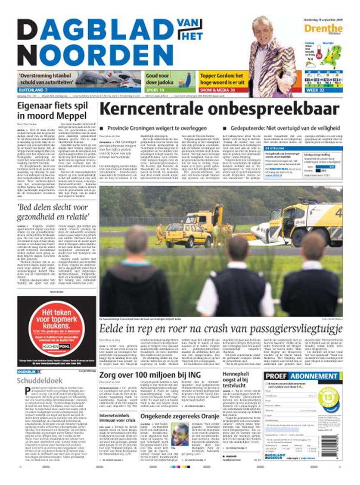
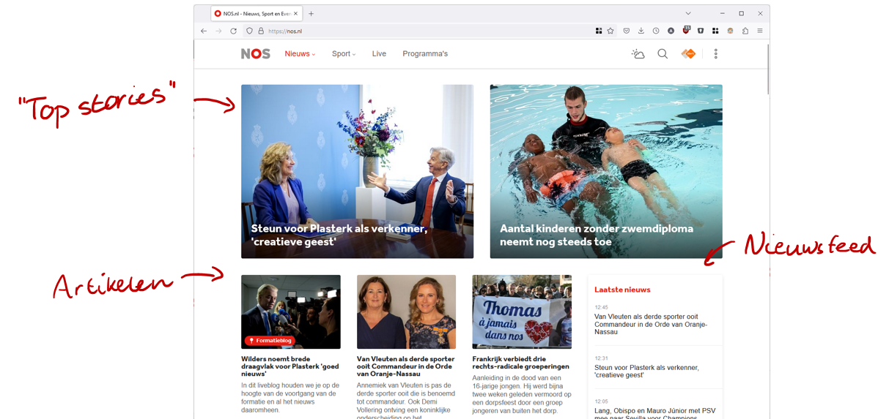
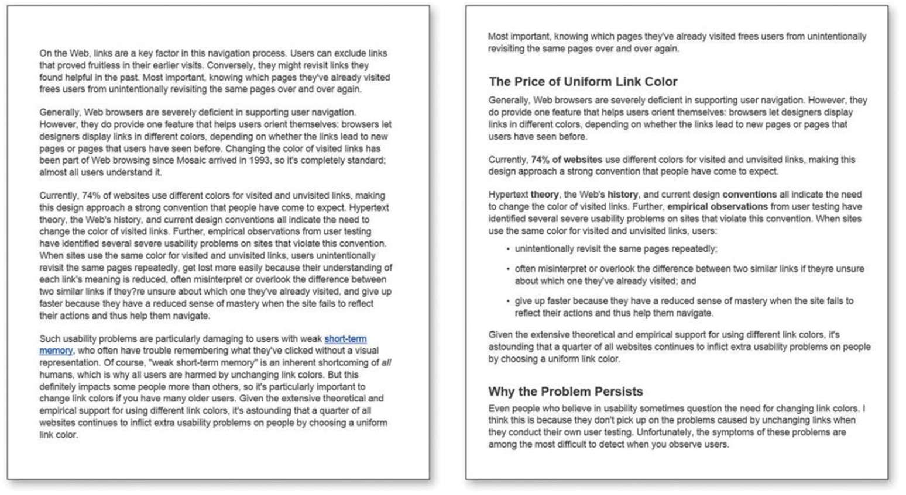

# Basisregels voor goed design

:::{exercise} Wat is goed design?

*Deze oefening doen we tijdens de tweede bijeenkomst.* Zoek samen met 2 à 3 andere leerlingen naar wat het design van een website goed of juist niet zo goed maakt. Volg deze stappen:

1. (Alleen) Bekijk de website van bijvoorbeeld een vereniging waar je lid van bent (of iets anders dat voor jou relevant is). Bedenk voor jezelf: wat is er *goed* aan deze site? En wat is er *slecht* of *onhandig* aan deze site? Maak eventueel een paar aantekeningen.
2. Laat de website aan je groepje zien. Vertel wat jij ervan vindt en bespreek samen wat jullie wel en niet goed vinden aan deze site. Ga je hele groepje rond.
3. Concludeer: wat maakt een website goed of slecht in het algemeen? Maak twee kolommen op het vel dat jullie hebben gekregen en schrijf je conclusies op.

:::

## Regel 1: Don't make me think

Uiteindelijk is er één basisregel voor goed design: zorg ervoor dat je gebruikers niet hoeven na te denken. Het moet meteen duidelijk zijn waar de website voor is en hoe gebruikers dat kunnen vinden waar ze voor komen. "Don't make me think" is dan ook de titel van een bekend boek over webdesign:

Het is namelijk zo dat webgebruikers

1. een webpagina niet lezen, maar hooguit scannen;
2. geen weloverwogen keuzes maken, maar snel gaan voor "goed genoeg"; en
3. niet uitzoeken hoe dingen werken, maar langzaam doormodderen.

Daarom is het belangrijk om je website vorm te geven alsof iemand er op hoge snelheid langskomt, en dan toch een idee moet hebben waar het over gaat. Met andere woorden: jouw website is een reclamebord. Er zijn zes basisprincipes die je toe kunt passen om ervoor te zorgen dat jouw gebruikers zo min mogelijk hoeven na te denken bij het gebruik van jouw website:

- Gebruik conventies
- Creëer een visuele hiërarchie
- Verdeel de pagina in duidelijke blokken
- Maak duidelijk wat klikbaar is
- Laat afleidingen weg
- Maak je tekst scanbaar

## Gebruik conventies

Kort gezegd: doe wat mensen verwachten. Dus zet je logo linksboven en de navigatie bovenin daarnaast of aan de linkerkant naar beneden, zoals vrijwel elke andere website dat ook doet. Als je een webshop bouwt, zorg dan dat je ook een winkelmandje hebt (zoals elke webshop). Gebruik de standaardicoontjes die we inmiddels met bepaalde zaken associëren: dus een play-knop voor video's, een vergrootglas voor een zoekveld, etc.

Dat is overigens niet alleen bij websites van toepassing: bij auto's zitten de pedalen ook altijd in dezelfde volgorde op dezelfde plek. Op audioapparatuur zijn er vaste iconen voor spelen (driehoekje), pauze (twee streepjes), stop (een blokje).

Maar: duidelijkheid is belangrijker dan consistentie. Als je jouw website veel duidelijker kunt maken door niet op iedere plek hetzelfde te doen, dan is dat zeker de moeite waard. Dat is een belangrijk punt: deze vuistregels zijn geen strikte geboden. Soms moet je een afweging maken tussen verschillende principes.

## Creëer een visuele hiërarchie

Zorg dat de dingen die belangrijk zijn ook groot in beeld zijn, en de dingen die minder belangrijk zijn juist minder de aandacht trekken.

Bij de visuele hiërarchie hoort ook dat dingen die bij elkaar horen bij elkaar staan. Dat betekent dus dat je in de navigatie van een webshop de productcategorieën bij elkaar zet, en niet de pagina's van de klantenservice daar tussendoor. Het betekent ook dat het duidelijk moet zijn welke prijs bij welk artikel hoort, door de onderdelen duidelijk af te bakenen. Met een nette HTML-structuur kom je hier al een heel eind in je design.

Kranten zijn hier bijvoorbeeld vrij goed in. Hieronder staat de voorpagina van een krant uit 2009 (toen waren kranten nog groot en stond er nog veel op de voorpagina). Het is meteen helder welke kop bij welk artikel hoort, doordat de kop over de hele breedte van de artikelen loopt. Met dunne lijnen worden blokken afgebakend, om ook te laten zijn bij welk artikel een afbeelding hoort.

## Duidelijke blokken

Onderdeel van het niet-hoeven-nadenken is dat gebruikers meteen kunnen zien waar ze bepaalde informatie kunnen vinden. Met duidelijke blokken kun je ervoor zorgen dat meteen helder is welke informatie waar op de pagina te vinden is.

De site van de NOS doet dat bijvoorbeeld met drie grote blokken: de "top stories", de artikelen en een nieuwsfeed. De "top stories" zijn de belangrijkste artikelen van dat moment, vaak met iets meer achtergrond voor de mensen die af en toe langs komen voor het belangrijke nieuws. Daaronder staat dan de lijst van alle artikelen die zijn verschenen. De echte nieuwsjunk kan meteen naar de sectie met het laatste nieuws, waar de artikelen gesorteerd op tijd en met het tijdstip erbij worden weergegeven.

## Wat is klikbaar?

Klikken is een van de belangrijkste acties op het web: alle navigatie gebeurd door klikken en het web gebruiken gaat veel over het navigeren van de ene pagina naar de andere. Daarom is het belangrijk voor gebruikers om te weten waar je op kunt klikken. Zorg dus dat knoppen eruit zien als knoppen en linkjes als linkjes. Gebruik de conventies!

## Geen afleiding

Zorg voor een rustige pagina, waar mensen niet afgeleid worden door zaken die er niet toe doen. Dus geen overbodige animaties, maak het niet te druk met verschillende kleuren, lettertypes en achtergronden. Zorg ook voor een heldere structuur (aansluitend op de visuele hiërarchie en duidelijke blokken). Zo moet het dus niet:

## Maak je tekst scanbaar

Niemand leest lange teksten op je homepagina. Ja, als je een journalistieke site bent, mag je best een longread publiceren, maar niet op je homepagina! Zorg dat je teksten scanbaar zijn door goed gebruik te maken van tussenkopjes, lijstjes voor opsommingen, korte alinea's en dikgedrukte highlights van belangrijke termen.

Bekijk bijvoorbeeld de twee teksten hieronder. In welke tekst kun je sneller vinden waar je naar op zoek bent?

