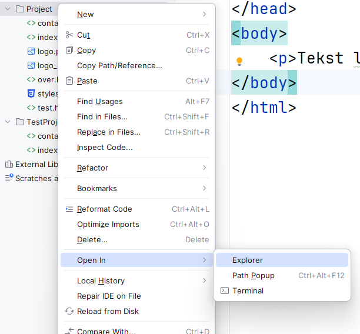

# Eindopdracht

Na het oefenen met het maken van een website is het nu tijd om het eindproduct voor deze module te gaan maken. Zo kan je alle geleerde kennis meteen toepassen en een website maken die je nog gaat gebruiken.

De opdracht is eenvoudig: maak een website! Het onderwerp en de inhoud van de site mag je zelf bepalen, en ook het design is aan jou (maar denk wel aan wat je daarover tijdens de les hebt geleerd). In een begeleidend document leg je kort uit welke keuzes je in het design hebt gemaakt.

Wat wel belangrijk is: je website moet in principe publiceerbaar zijn. Dat betekent dat je je ook aan copyright regels moet houden, en dus geen teksten of afbeeldingen kopieert die niet van jou zijn, als je daar geen toetstemming voor hebt. Dat geldt ook voor de HTML en CSS code: in principe schrijf je die zelf, tenzij je toestemming hebt om die code te kopiëren **en** je dat duidelijk vermeldt met commentaar. Zie de [Handleiding code stelen](https://informatica.q-highschool.nl/informatie/code-stelen-van-het-internet-of-leerling) voor meer informatie. Code die je gekopieerd hebt, telt voor de beoordeling natuurlijk niet mee in de eisen aan HTML en CSS. En voor het design krijg je ook geen punten, als dat niet je eigen design is. Je laten inspireren en zelfs elementen overnemen is prima, maar de kern moet altijd je eigen werk zijn.

## Eisen

Er zijn natuurlijk wel wat eisen aan de site, want je moet ermee laten zien dat je webdesign nu onder de knie hebt. De eisen zijn verdeeld in drie categorieën: HTML, CSS en design. Voor elk van die onderdelen kun je maximaal 3 punten krijgen. Je krijgt gratis een 1, dus met 3 punten voor elk van de onderdelen kom je op 1 + 3 + 3 + 3 = 10 als eindcijfer. Per onderdeel staat beschreven hoe het beoordeeld wordt.

### HTML

> Voor een voldoende moet je minimaal aan de **dikgedrukte** eisen voldoen.

Hoeveel werk is het?

- Gebruik minimaal **twee** verschillende webpagina’s
- **Zet op elke pagina linkjes naar de andere pagina's, bijvoorbeeld in een menu**
- Maak minimaal één link die buiten je website verwijst
- Gebruik minimaal **één** plaatje
- Maak gebruik van minimaal één tabel
- Maak gebruik van een unordered list of ordered list

Werkt het?

- **De webpagina wordt correct weergegeven in de browser**

Is de code netjes?

> Voor een voldoende moet je duidelijk een poging gedaan hebben aan de **dikgedrukte** eisen te voldoen.

- **Gebruik de structuur van `h1`, `h2`, etc. tussenkopjes**
- *Gebruik de structuur van semantic elements*
- Gebruik comments in je code <- alleen als er iets is bijzonders is
- **Gebruik goede indentation**
- Je HTML is valide volgens de [W3C HTML validator](https://validator.w3.org/#validate_by_input) (zie HTML opdracht 5)

### CSS

Hoeveel werk is het?

> Voor een voldoende moet je minimaal aan de **dikgedrukte** eisen voldoen.

- **Gebruik minimaal één CSS-bestand**
- **Geef de tekst een aangepaste stijl**
- Gebruik op ten minste 1 plek een aangepaste kleur
- Gebruik randen ten minste één keer
- Geef de verschillende link states een aangepaste stijl
- ^ **Minimaal 1 van de 3 hierboven**
- Maak gebruik van margin en padding
- Maak gebruik van `width` en/of `height`
- Gebruik een van de layout properties om elementen te positioneren
- ^ **Minimaal 1 van de 3 hierboven**
- Bonuspunten (zie {doc}`bijlage/extra`):
  - Gebruik een web font
  - Gebruik een icon
  - Maak een dropdown menu
  - Voeg animaties toe
  - Gebruik responsive webdesign technieken
  - Gebruik Bootstrap (naast je eigen CSS!)

Werkt het?

- **De webpagina wordt met de juiste stijl weergegeven in de browser**

Is de code netjes?

> Voor een voldoende moet je duidelijk een poging gedaan hebben aan de **dikgedrukte** eisen te voldoen.

- **Gebruik goede indentation**
- **Elke eigenschap is afgesloten met `;`**
- Gebruik consistente spaties en witregels
- Je CSS is valide volgens de [W3C CSS validator](https://jigsaw.w3.org/css-validator/#validate_by_input)

### Design

Voeg een document toe aan je website waarin je uitlegt welke designkeuzes je hebt gemaakt. Waarom zit de navigatie daar? Wat heb je gedaan om het overzichtelijk te houden? Benoem hoe je de [basisregels](design/basisregels.md) hebt toegepast en wat de resultaten van jouw [usability tests](design/usability_testing.md) waren.

Naast je uitleg, kijken we ook naar de volgende punten:

- Duidelijk doel
- Overzichtelijk, duidelijke structuur op de pagina
- Duidelijke navigatie tussen pagina's
- Consistent
- Tekst is leesbaar (dus bijv. niet te klein)
- Lettertype past bij de site en is goed leesbaar
- Voldoende contrast tussen kleuren (dus geen grijze tekst op een grijze achtergrond)
- Goed gebruik van afbeeldingen

## Inleveren

Je levert je website in via de Inlever-knop op [app.q-highschool.nl](https://app.q-highschool.nl). Je kunt daar maar één bestand inleveren, dus moet je alle bestanden van je website (HTML, CSS, afbeeldingen, etc.) een .zip bestand maken.

1. Zorg dat alle bestanden in hetzelfde mapje in WebStorm staan.
2. Open die map in de verkenner. Dat kun je makkelijk doen vanuit WebStorm: klik met de rechtermuisknop op de map met jouw eindopdracht en kies *Open In* > *Explorer*.
   
3. Maak een .zip bestand volgens [deze instructies](https://informatica.q-highschool.nl/informatie/meerdere-bestanden-inleveren). Vergeet niet om ook je document met uitleg over je [design](#design) toe te voegen aan deze map!
4. Lever het .zip-bestand in op [app.q-highschool.nl](https://app.q-highschool.nl).

## Geen inspiratie?

Maak een CV! Bij het solliciteren voor een nieuwe baan wordt bijna altijd om je curriculum vitae (CV) gevraagd. Voor veel mensen is dit een simpel Word-bestandje of PDF waarin de werkervaring en opleidingen van een persoon staan. Vaak wordt daar ook nog een beetje informatie over jezelf aan toegevoegd. In onze ogen is dat allemaal een beetje achterhaald, wij vinden namelijk dat iedereen binnen de informaticawereld een online CV moet hebben! Dat is dan ook de opdracht, je gaat een website maken als vervanging voor je CV.

Als je nog nooit een CV hebt gemaakt dan is [deze site](http://www.carrieretijger.nl/carriere/solliciteren/sollicitatiebrief-en-cv/cv-opstellen) misschien een goede plek om te beginnen. Als je al een CV hebt dan is het slechts een kwestie van die informatie in een goede website verwerken!
