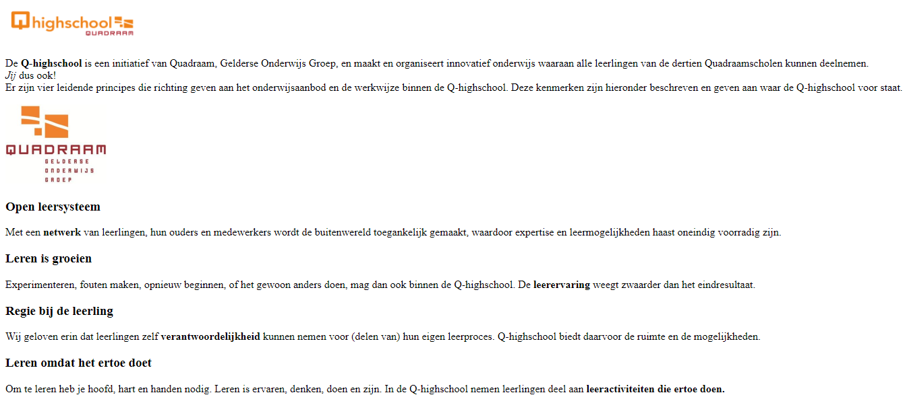

# Opdracht 1 - Simpele elementen

1. Als je WebStorm voor de eerste keer opent, druk dan op:  Als je WebStorm al een keer hebt geopend, maak dan een nieuw project met File > New > Project... Gebruik de naam `WebDevelopment` voor je project, laat de rest van de instellingen hetzelfde en druk op Create. Maak een nieuwe map binnen `WebDevelopment` door met de rechtermuisknop op de map te klikken en dan New → Directory te selecteren. Noem deze map `Opdracht_1`. Maak bij elke opdracht weer een nieuwe map, op die manier kun je alle opdrachten goed gescheiden houden. Kopieer dan meteen alle bestanden van de vorige opdracht naar je nieuwe map, we bouwen namelijk verder op de website uit de vorige opdracht. Maak een nieuw bestand in de opdrachtmap door met de rechtermuisknop op de map te klikken en dan New > HTML-file. Noem het bestand `index` en druk op enter. Zo wordt de boilerplate code alvast voor je toegevoegd.

   Voor de meeste mensen geldt dat ze dingen beter onthouden en begrijpen als ze het zelf overtypen, probeer dus zo veel mogelijk zelf te typen en zo min mogelijk te kopiëren. Op die manier vergroot je de kans dat je het in één keer begrijpt. Dit geldt niet alleen voor deze module, maar is belangrijk om te doen in alle informatica modules binnen de Q-Highschool.

2. Druk in de balk bovenaan of aan de linkerkant met de rechtermuisknop op index.html Selecteer vervolgens de optie `Debug ‘index.html’`. WebStorm opent nu jouw website.

   In de meeste IDE's betekent de **debug modus** dat er een live versie van je code wordt geopend. Op die manier kun je aan je code werken terwijl je programma bezig is. In ons geval met web development betekent het dat WebStorm onze webpagina opent en bij iedere wijziging meteen voor ons ververst.

   Je ziet in WebStorm zelf dat alle tekst een aparte kleur heeft. Dit is om de code makkelijker te lezen en te begrijpen te maken. Dit heet **syntax highlighting** en is in vrijwel alle IDE's aanwezig.

   ## Indentation

   Als het goed is, zie je nu een witte pagina met de tekst `Title` in het kopje van het tabblad. Gefeliciteerd! Je eerste website is een feit. Hij is alleen nog wel een beetje saai met die witte pagina. Daar gaan we zo dadelijk wat inhoud aan toevoegen, maar eerst is het belangrijk om te leren over **indentation**. Het is belangrijk dat je code altijd indent. Dit houdt in dat voor andere programmeurs makkelijk te zien moet zijn hoe je code in elkaar zit. Voor sommige programmeertalen is het zelfs verplicht om indentation te gebruiken, ze functioneren niet goed zonder indentation. Voor indentation gebruiken wij de Tabtoets. Voor indentation gelden meestal de volgende regels:

   Zorg ervoor dat de start en end tags altijd op 'hetzelfde niveau' zitten. Dit houdt in dat ze een gelijke afstand tot de linkerzijde van het scherm moeten hebben. Een uitzondering hierop is een tag die zo kort is dat de start en end tags op dezelfde regel kunnen staan. Zet ze in dit geval op dezelfde regel. Bijvoorbeeld:

   ``` html
   <p>
       Dit is een lang stuk tekst waarbij de omringende start- en end tags op
       hetzelfde niveau moeten zitten. Op deze manier hebben ze een gelijke
       afstand tot de linkerzijde van het scherm en is de code overzichtelijk
       voor alle programmeurs die het lezen. Hieronder staat een voorbeeld van
       een korte regel tekst. Bij deze tekst zitten de start- en end tags op
       één regel.
   </p>
   <p>Een kort stuk tekst.</p>
   ```
   
   Wanneer een tag binnen een andere tag valt dan mogen deze niet op hetzelfde niveau zitten. De binnenste tag moet een grotere afstand hebben tot de linkerkant dan de buitenste tag. Bijvoorbeeld:
   
   ``` html
   <body>
       <p>Een stuk tekst</p>
   </body>
   ```
   
   En dus niet:
   
   ``` html
   <body>
   <p>Een stuk tekst</p>
   </body>
   ```
   
   De regels lijken nu een beetje ingewikkeld, maar als je goed kijkt naar de voorbeelden dan zie je het vanzelf terugkomen. De boilerplate code uit het begin van deze opdracht volgt goede indentation. Je zult merken dat de boilerplate code binnen WebStorm er iets anders uit ziet. Veel programmeurs vinden het namelijk onzinnig om de `<head>` en `<body>` met indentation binnen `<html>` te zetten. Wij houden deze structuur ook aan en hebben die drie elements allemaal op één lijn staan. De boilerplate code *zonder* indentation ziet er zo uit:
   
   ``` html
   <!DOCTYPE html>
   <html lang="nl">
   <head>
   <meta charset="utf-8"/>
   <title>Hello World</title>
   </head>
   <body>
   </body>
   </html>
   ```
   
   Vraag de eerste paar keren dat je programmeert aan klasgenoten of desnoods aan je docent of je indentation klopt. Voor meer informatie over indentation: <https://www.granneman.com/webdev/coding/formatting-and-indenting-your-html#examples>
   
   ## Het p-element
   
   Nu gaan we dan toch echt aan de inhoud werken! Met het belangrijkste element heb je al een beetje kennisgemaakt, dat is namelijk `p`. Met dit element kun je een alinea maken.

3. Voeg in WebStorm een `p` toe binnen de body met wat tekst naar keuze. Zorg ervoor dat het er ongeveer zo uit komt te zien:

   ``` html
   <body>
       <p>
           Wat leuke tekst om je website te testen.
       </p>
   </body>
   ```
   
   Als het goed is zie je nu ook meteen je geschreven tekst op de website.
   
   ## Tekst formatteren
   
   Binnen deze alinea's kun je ook nog aanpassen hoe de tekst eruitziet op de volgende manieren:
   
   - *`<b>Tekst</b>`* binnen deze tag is de tekst dikgedrukt (**bold** in het Engels).
   - *`<i>Tekst</i>`* binnen deze tag is de tekst schuingedrukt (*italics* in het Engels).
   - *`<s>Tekst</s>`* binnen deze tag is de tekst doorgestreept (~~strikethrough~~ in het Engels).
   - *`<mark>Tekst</mark>`* binnen deze tag is de tekst gemarkeerd.
   - *`<br/>`* gaat naar een nieuwe regel, staat gelijk aan één keer op ENTER drukken.
   - Veel meer vind je op <https://www.w3schools.com/tags/ref_byfunc.asp> onder het kopje `Formatting`
   
   Deze tags mogen middenin de tekst gebruikt worden, je hoeft hier niks mee te doen voor indentation.

4. Schrijf nu een paar stukjes tekst over jezelf of iets anders binnen de alinea. Gebruik een paar van de hierboven beschreven elements om je tekst er iets leuker uit te laten zien.
5. (Optioneel) Kijk op de website van w3schools en zoek naar nog meer tags om je tekst mee op te vrolijken. Gebruik daar ook een paar van.

   ## Kopjes

   Je tekst ziet er voor nu waarschijnlijk heel ongestructureerd uit, laten we hier verandering in brengen. HTML heeft al een paar kopjes ingebouwd, deze worden gebruikt door de `h1`, `h2`, `h3`, `h4`, `h5` en `h6` in je HTML-bestand te zetten. Hierbij is `h1` het belangrijkste en grootste kopje en `h6` het minst belangrijke en kleine kopje.

6. Voeg kopjes toe aan je stuk tekst om het overzichtelijker te maken.

   ## Afbeeldingen
   
   Met alleen maar tekst blijft de website toch nog een beetje saai. Je kan gelukkig ook plaatjes toevoegen met HTML. Dit doe je met `img` Deze tag ziet er als volgt uit: ``. De afbeeldingsbron kan een pad zijn naar een ander bestand of een link naar een afbeelding online. De breedte en hoogte van het plaatje zijn in pixels en hoeven niet hetzelfde te zijn als het origineel. Een alt attribute moet altijd bij een img tag zitten, anders geven sommige browsers een fout.
   
   Een belangrijk aspect bij het gebruiken van foto's op het internet is de wetgeving. Je mag namelijk niet zomaar ieder plaatje dat je online vindt gebruiken in je website. Kijk voor meer informatie over de wetgeving en voor locaties van rechtenvrije foto's op <https://www.riffonline.com/nl/happening/knowledge/de-wetgeving-voor-het-gebruik-van-fotos-op-het-web/>

7. Voeg een afbeelding van het internet naar keuze toe op een plek naar keuze. Experimenteer een beetje met de breedte en de hoogte om te zien wat er met het plaatje gebeurt. Vergelijk de waardes die je invult en het resultaat dat je krijgt met de originele afmetingen van het plaatje. Welke conclusie kun je hieruit trekken?

8. Download een afbeelding vanaf het internet en zet die in een map genaamd sources in de map `Opdracht 1`. Geef hem een herkenbare naam en noteer de bestandsextentie (`.png`, `.jpg`, etc.). Voeg de afbeelding vervolgens toe aan de website met `src="sources/naam.extentie"`.

   In theorie is het mogelijk om een afbeelding te allen tijde vanaf het internet te laden op je website. Dit zorgt echter voor langere laadtijden omdat de afbeelding nog gedownload moet worden vanaf een andere website. Ook kan de website van de afbeelding opeens offline gaan, waardoor deze niet meer geladen kan worden. Zorg er daarom altijd voor dat je een lokale versie van de afbeelding in je map hebt staan, op die manier ben je altijd zelf verantwoordelijk voor de bereikbaarheid van de afbeelding en heb je een snelle website.

Nu heb je jouw eerste echte website gemaakt. Hij is nog redelijk simpel, maar je mag echt wel trots op jezelf zijn. Dit is een voorbeeld van hoe je website eruit zou kunnen zien:



``` html
<!DOCTYPE html>
<html lang="nl">
    <head>
        <meta charset="utf-8" />
        <title>Q-highschool</title>
    </head>
    <body>
        
        <p>
            De <b>Q-highschool</b> is een initiatief van Quadraam,
            Gelderse Onderwijs Groep, en maakt en organiseert innovatief onderwijs
            waaraan alle leerlingen van de dertien Quadraamscholen kunnen deelnemen.
            <br /><i>Jij</i> dus ook!<br /> Er zijn vier
            leidende principes die richting geven aan het onderwijsaanbod en de
            werkwijze binnen de Q-highschool. Deze kenmerken zijn hieronder
            beschreven en geven aan waar de Q-highschool voor staat.
        </p>
        
        <h3>Open leersysteem</h3>
        <p>
            Met een <b>netwerk</b> van leerlingen, hun ouders en
            medewerkers wordt de buitenwereld toegankelijk gemaakt, waardoor
            expertise en leermogelijkheden haast oneindig voorradig zijn.
        </p>
        <h3>Leren is groeien</h3>
        <p>
            Experimenteren, fouten maken, opnieuw beginnen, of het gewoon anders
            doen, mag dan ook binnen de Q-highschool.
            De<b>leerervaring</b> weegt zwaarder dan het eindresultaat.
        </p>
        <h3>Regie bij de leerling</h3>
        <p>
            Wij geloven erin dat leerlingen zelf
            <b>verantwoordelijkheid</b> kunnen nemen voor (delen van)
            hun eigen leerproces. Q-highschool biedt daarvoor de ruimte en de
            mogelijkheden.
        </p>
        <h3>Leren omdat het ertoe doet</h3>
        <p>
            Om te leren heb je hoofd, hart en handen nodig. Leren is ervaren,
            denken, doen en zijn. In de Q-highschool nemen leerlingen deel aan
            <b>leeractiviteiten die ertoe doen.</b>
        </p>
    </body>
</html>
```
