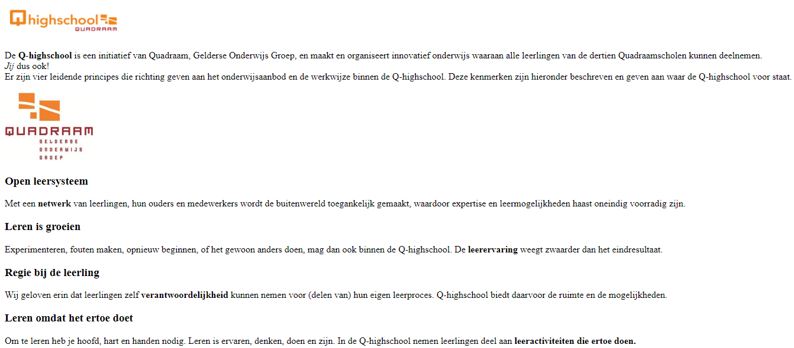

# Oefening 1 - Simpele elementen

:::{exercise}
Start **Visual Studio Code (VS Code)** en maak je projectmap aan.

1. **Map openen:** *File → Open Folder…* en kies/maak een map **WebDevelopment**.  
2. **Oefening-map aanmaken:** Maak in de Verkenner (links) een map **Opdracht_1**.  
3. **Nieuw bestand:** Maak in **Opdracht_1** een bestand **index.html**.  
4. **Boilerplate toevoegen:** Typ `!` en druk **Tab** (of **Enter**) om via *Emmet* de HTML-boilerplate in te voegen.  
5. Voor elke nieuwe oefening maak je een **nieuwe map** aan. Kopieer desgewenst bestanden uit je vorige oefening als je verder bouwt op die website.
:::

Voor de meeste mensen geldt dat ze dingen beter onthouden en begrijpen als ze het zelf overtypen, probeer dus zo veel mogelijk zelf te typen en zo min mogelijk te kopiëren. Op die manier vergroot je de kans dat je het in één keer begrijpt. Dit geldt niet alleen voor deze module, maar is belangrijk om te doen in alle informatica modules binnen de Q-highschool.

:::{exercise}
Bekijk je pagina in de browser.

**Aanbevolen (Live Server-extensie):** Rechtsklik op **index.html** → *Open with Live Server*. De pagina opent en ververst automatisch bij wijzigingen.  
**Zonder extensie:** Open de map in je bestandsbeheer en dubbelklik **index.html** om deze in je browser te openen.
:::

Met **Live Server** in VS Code krijg je een live versie van je site die automatisch herlaadt bij het opslaan. In VS Code zie je dat code in kleuren wordt weergegeven: dat heet **syntax highlighting** en helpt je de code beter te lezen.

## Indentation

Als het goed is, zie je nu een witte pagina met de tekst Title in het tabblad van je browser. Gefeliciteerd! Je eerste website is een feit. Hij is alleen nog wel een beetje saai met die witte pagina.  

Sommige editors genereren de boilerplate met extra inspringing (indentation) voor `<head>` en `<body>` binnen `<html>`. In deze module houden we geen extra indentation op het `<html>`-niveau aan; de drie elementen staan op één lijn. De boilerplate zonder extra indentation ziet er zo uit: 

```html
<!DOCTYPE html>
<html lang="nl">
<head>
    <meta charset="utf-8"/>
    <title>Hello World</title>
</head>
<body>
</body>
</html>
```
Vraag de eerste paar keren dat je programmeert aan klasgenoten of aan je docent of je indentation klopt. Meer over indentation: [https://www.granneman.com/webdev/coding/formatting-and-indenting-your-html#examples]

   
## Het p-element

Nu gaan we dan toch echt aan de inhoud werken! Met het belangrijkste element heb je al een beetje kennisgemaakt, dat is namelijk `p`. Met dit element kun je een alinea maken.

:::{exercise}
Voeg in Visual Studio Code een `p` toe binnen de body met wat tekst naar keuze. Zorg ervoor dat het er ongeveer zo uit komt te zien:

``` html
<body>
    <p>
        Wat leuke tekst om je website te testen.
    </p>
</body>
```
:::

Als het goed is zie je nu ook meteen je geschreven tekst op de website.
   
## Tekst formatteren
   
Binnen deze alinea's kun je ook nog aanpassen hoe de tekst eruitziet op de volgende manieren:

- *`<b>Tekst</b>`* binnen deze tag is de tekst dikgedrukt (**bold** in het Engels).
- *`<i>Tekst</i>`* binnen deze tag is de tekst schuingedrukt (*italics* in het Engels).
- *`<s>Tekst</s>`* binnen deze tag is de tekst doorgestreept (~~strikethrough~~ in het Engels).
- *`<mark>Tekst</mark>`* binnen deze tag is de tekst gemarkeerd.
- *`<br/>`* gaat naar een nieuwe regel, staat gelijk aan één keer op ENTER drukken.
- Veel meer vind je op <https://www.w3schools.com/tags/ref_byfunc.asp> onder het kopje `Formatting`

Deze tags mogen middenin de tekst gebruikt worden, je hoeft hier niks mee te doen voor indentation.

:::{exercise}
Schrijf nu een paar stukjes tekst over jezelf of iets anders binnen de alinea. Gebruik een paar van de hierboven beschreven elements om je tekst er iets leuker uit te laten zien.
:::

:::{exercise} (Optioneel)
Kijk op de website van [W3Schools](https://www.w3schools.com/tags/ref_byfunc.asp) en zoek naar nog meer tags om je tekst mee op te vrolijken. Gebruik daar ook een paar van.
:::

## Kopjes

Je tekst ziet er voor nu waarschijnlijk heel ongestructureerd uit, laten we hier verandering in brengen. HTML heeft al een paar kopjes ingebouwd, deze worden gebruikt door de `h1`, `h2`, `h3`, `h4`, `h5` en `h6` in je HTML-bestand te zetten. Hierbij is `h1` het belangrijkste en grootste kopje en `h6` het minst belangrijke en kleine kopje.

:::{exercise}
Voeg kopjes toe aan je stuk tekst om het overzichtelijker te maken.
:::

## Afbeeldingen
   
Met alleen maar tekst blijft de website toch nog een beetje saai. Je kan gelukkig ook plaatjes toevoegen met HTML. Dit doe je met `img` Deze tag ziet er als volgt uit: ``. De afbeeldingsbron kan een pad zijn naar een ander bestand of een link naar een afbeelding online. De breedte en hoogte van het plaatje zijn in pixels en hoeven niet hetzelfde te zijn als het origineel. Een alt attribute moet altijd bij een img tag zitten, anders geven sommige browsers een fout.
   
Een belangrijk aspect bij het gebruiken van foto's op het internet is de wetgeving. Je mag namelijk niet zomaar ieder plaatje dat je online vindt gebruiken in je website. Kijk voor meer informatie over de wetgeving en voor locaties van rechtenvrije foto's op <https://www.riffonline.com/nl/happening/knowledge/de-wetgeving-voor-het-gebruik-van-fotos-op-het-web/>

:::{exercise}
Voeg een afbeelding van het internet naar keuze toe op een plek naar keuze. Experimenteer een beetje met de breedte en de hoogte om te zien wat er met het plaatje gebeurt. Vergelijk de waardes die je invult en het resultaat dat je krijgt met de originele afmetingen van het plaatje. Welke conclusie kun je hieruit trekken?
:::

:::{exercise}
Download een afbeelding vanaf het internet en zet die in een map genaamd `sources` in de map `Opdracht 1`. Geef hem een herkenbare naam en noteer de bestandsextentie (`.png`, `.jpg`, etc.). Voeg de afbeelding vervolgens toe aan de website met `src="sources/naam.extentie"`.
:::

In theorie is het mogelijk om een afbeelding te allen tijde vanaf het internet te laden op je website. Dit zorgt echter voor langere laadtijden omdat de afbeelding nog gedownload moet worden vanaf een andere website. Ook kan de website van de afbeelding opeens offline gaan, waardoor deze niet meer geladen kan worden. Zorg er daarom altijd voor dat je een lokale versie van de afbeelding in je map hebt staan, op die manier ben je altijd zelf verantwoordelijk voor de bereikbaarheid van de afbeelding en heb je een snelle website.

Nu heb je jouw eerste echte website gemaakt. Hij is nog redelijk simpel, maar je mag echt wel trots op jezelf zijn. Dit is een voorbeeld van hoe je website eruit zou kunnen zien:



``` html
<!DOCTYPE html>
<html lang="nl">
    <head>
        <meta charset="utf-8" />
        <title>Q-highschool</title>
    </head>
    <body>
        
        <p>
            De <b>Q-highschool</b> is een initiatief van Quadraam,
            Gelderse Onderwijs Groep, en maakt en organiseert innovatief onderwijs
            waaraan alle leerlingen van de dertien Quadraamscholen kunnen deelnemen.
            <br /><i>Jij</i> dus ook!<br /> Er zijn vier
            leidende principes die richting geven aan het onderwijsaanbod en de
            werkwijze binnen de Q-highschool. Deze kenmerken zijn hieronder
            beschreven en geven aan waar de Q-highschool voor staat.
        </p>
        
        <h3>Open leersysteem</h3>
        <p>
            Met een <b>netwerk</b> van leerlingen, hun ouders en
            medewerkers wordt de buitenwereld toegankelijk gemaakt, waardoor
            expertise en leermogelijkheden haast oneindig voorradig zijn.
        </p>
        <h3>Leren is groeien</h3>
        <p>
            Experimenteren, fouten maken, opnieuw beginnen, of het gewoon anders
            doen, mag dan ook binnen de Q-highschool.
            De<b>leerervaring</b> weegt zwaarder dan het eindresultaat.
        </p>
        <h3>Regie bij de leerling</h3>
        <p>
            Wij geloven erin dat leerlingen zelf
            <b>verantwoordelijkheid</b> kunnen nemen voor (delen van)
            hun eigen leerproces. Q-highschool biedt daarvoor de ruimte en de
            mogelijkheden.
        </p>
        <h3>Leren omdat het ertoe doet</h3>
        <p>
            Om te leren heb je hoofd, hart en handen nodig. Leren is ervaren,
            denken, doen en zijn. In de Q-highschool nemen leerlingen deel aan
            <b>leeractiviteiten die ertoe doen.</b>
        </p>
    </body>
</html>
```
