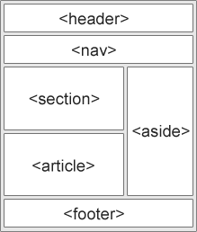
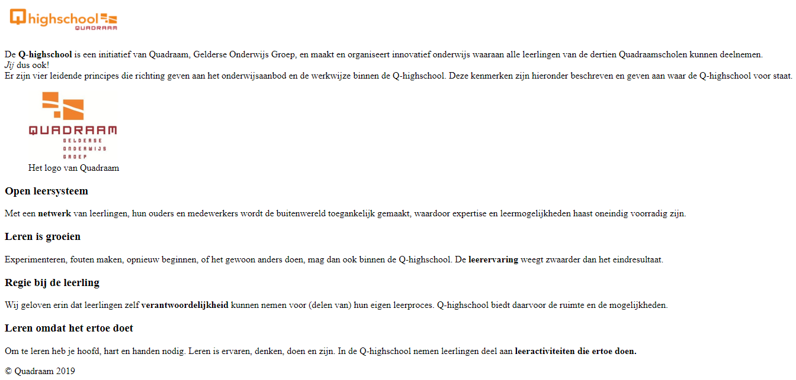

# Opdracht 2 - Organisatie

Zoals je misschien al hebt gemerkt tijdens het lezen van de code in het voorbeeld is het niet op het eerste gezicht duidelijk hoe de website georganiseerd is. In HTML5 is hier een nieuw systeem voor geïntroduceerd, dit bestaat uit de zogenaamde **Semantic Elements**. Deze elements zorgen ervoor dat elke website in de basis op dezelfde manier gestructureerd kan worden zoals hiernaast. Door deze structuur kunnen computers en zoekmachines beter omgaan met de websites, waardoor de ervaring van de gebruiker verbeterd.



## H​eader

`<header></header>` wordt gebruikt om de kop van een website of sectie te weergeven. Er mogen meer headers in één website gebruikt worden op verschillende plekken. `header` moet altijd in de omringende 'container' geplaatst worden voor de sectie of de website.

## Nav

`<nav></nav>` wordt gebruikt om de hoofdnavigatie van de website weer te geven. In dit element zet je alle knoppen naar andere delen van je website.

## Section

`<section></section>` wordt gebruikt om secties in de website uit elkaar te houden. Dit is inhoud die thematisch bij elkaar hoort. Een startpagina zou bijvoorbeeld kunnen worden verdeeld in secties voor de introductie, de inhoud en contactinformatie.

## Article

`<article></article>` wordt gebruikt om onafhankelijke, op zichzelf staande inhoud van elkaar te scheiden. Op een blog kan bijvoorbeeld iedere blogpost een nieuw artikel zijn.

Je kan articles in sections zetten, maar dit kan ook andersom. Het artikel over een voetbalwedstrijd kan in de sportsectie zitten, maar kan tegelijkertijd ook verschillende secties bezitten over verschillende onderwerpen in de wedstrijd.

## Aside

`<aside></aside>` wordt gebruikt om wat inhoud naast de hoofdcontent te zetten. `aside` moet altijd een verband hebben met de inhoud eromheen.

## F​ooter

`<footer></footer>` wordt gebruikt om de voettekst van een document of sectie aan te geven. `footer` wordt veel gebruikt om de schrijver van het document, copyright informatie, contactinformatie en dat soort informatie te geven.

## Figure en figcaption

De `<figure></figure` en `<figcaption></figcaption>` worden gebruikt om een beschrijving toe te voegen bij een plaatje op de website. Dit gaat op de volgende manier:

``` html
<figure>
    
    <figcaption>Plaatje 1 - Plaatje</figcaption>
</figure>
```

Meer informatie over semantic elements kan je hier vinden: <https://www.w3schools.com/html/html5_semantic_elements.asp>

Maak een kopie van de website die je in opdracht 1 hebt gemaakt. Doe dit door binnen WebStorm met de rechtermuisknop op `Webdevelopment` te drukken en vervolgens New Directory te kiezen. Geef hem de naam `Opdracht 2` en druk op `OK`. Kopieer vervolgens het HTML-bestand uit `Opdracht 1` door er één keer op te klikken en vervolgens `CTRL + C` te gebruiken. Selecteer vervolgens de map `Opdracht 2` en gebruik `CTRL + V` om het bestand te plakken. Sluit het bestand uit de map `Opdracht 1` door bovenin de balk op het kruisje naast `index.html` te drukken. Open vervolgens het HTML-bestand `index.html` uit de map `Opdracht     2`.

> Pas het bestand aan en zorg ervoor dat hij nu voldoet aan de standaarden van semantic elements. Gebruik ieder semantic element ten minste één keer (behalve `nav`). Laat het controleren door klasgenoten of door de docent.

Hier is een voorbeeld van een goede implementatie:



``` html
<!DOCTYPE html>
<html lang="nl">
    <head>
        <meta charset="utf-8"/>
        <title>Q-highschool</title>
    </head>
    <body>
        <header>
            
        </header>
        <section>
            <p>
                De <b>Q-highschool</b> is een initiatief van Quadraam,
                Gelderse Onderwijs Groep, en maakt en organiseert innovatief onderwijs
                waaraan alle leerlingen van de dertien Quadraamscholen kunnen deelnemen.
                <br/><i>Jij</i> dus ook! <br/>Er zijn vier
                leidende principes die richting geven aan het onderwijsaanbod en de
                werkwijze binnen de Q-highschool. Deze kenmerken zijn hieronder
                beschreven en geven aan waar de Q-highschool voor staat.
            </p>
            <aside>
                <figure>
                    
                    <figcaption>Het logo van Quadraam</figcaption>
                </figure>
            </aside>
        </section>
        <section>
            <article>
                <h3>Open leersysteem</h3>
                <p>
                    Met een <b>netwerk</b> van leerlingen, hun ouders en
                    medewerkers wordt de buitenwereld toegankelijk gemaakt, waardoor
                    expertise en leermogelijkheden haast oneindig voorradig zijn.
                </p>
            </article>
            <article>
                <h3>Leren is groeien</h3>
                <p>
                    Experimenteren, fouten maken, opnieuw beginnen, of het gewoon anders
                    doen, mag dan ook binnen de Q-highschool. De
                    <b>leerervaring</b> weegt zwaarder dan het eindresultaat.
                </p>
            </article>
            <article>
                <h3>Regie bij de leerling</h3>
                <p>
                    Wij geloven erin dat leerlingen zelf
                    <b>verantwoordelijkheid</b> kunnen nemen voor (delen van)
                    hun eigen leerproces. Q-highschool biedt daarvoor de ruimte en de
                    mogelijkheden.
                </p>
            </article>
            <article>
                <h3>Leren omdat het ertoe doet</h3>
                <p>
                    Om te leren heb je hoofd, hart en handen nodig. Leren is ervaren,
                    denken, doen en zijn. In de Q-highschool nemen leerlingen deel aan
                    <b>leeractiviteiten die ertoe doen.</b>
                </p>
            </article>
        </section>
        <footer>© Quadraam 2019</footer>
    </body>
</html>
```

## Div en span

Voordat semantic elements de standaard werden werd er veel gewerkt met `<div></div>` en `<span></span>`. Deze elements worden gebruikt om andere elements te groeperen, net zoals de semantic elements doen. Er zit echter wel één groot verschil tussen de twee methoden. Dat verschil is dat bij semantic elements al is vastgesteld op welke manier elements gegroepeerd moeten worden, terwijl dat met `div` en `span` niet zo is.

`div` groepeert de elements bij elkaar en zet er een witregel onder en boven, op deze manier wordt een op zichzelf staand blok gemaakt. `span` groepeert de elements in-line bij elkaar, ze worden dus achter elkaar gezet.

Je kan en mag deze elements nog steeds gebruiken om andere elements te groeperen, maar wanneer je semantic elements kan gebruiken dan is het sneller en beter om deze te gebruiken.
