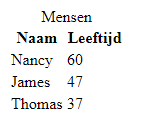
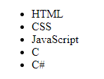
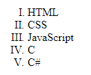

# Opdracht 3 - Tabellen en lijsten

Tabellen en lijsten zijn zeer handige manieren om informatie te ordenen. In HTML zijn hier dan ook verschillende elements aan toegewijd.

## Table

In HTML maak je een tabel met `<table></table>`. Hierbinnen maak je rijen met `<tr></tr>` en kolommen met `<td></td>`. Ook kan je de tabel kopjes geven met `<th></th>`. Je kan ook de hele tabel een kop geven met `<caption></caption>`. De syntax van een tabel is als volgt:



``` html
<table>
    <caption>Mensen</caption>
    <thead>
        <tr>
            <th>Naam</th>
            <th>Leeftijd</th>
        </tr>
    </thead>
    <tbody>
        <tr>
            <td>Nancy</td>
            <td>60</td>
        </tr>
        <tr>
            <td>James</td>
            <td>47</td>
        </tr>
        <tr>
            <td>Thomas</td>
            <td>37</td>
        </tr>
    </tbody>
</table>
```

Dit geeft het resultaat aan de rechterkant. Er kunnen nog meer dingen worden aangepast aan de tabel. Kijk hiervoor op <https://www.w3schools.com/html/html_tables.asp> als je geïnteresseerd bent. De tabel ziet er nu ook nog redelijk saai uit. Dit gaan we echter later met CSS verbeteren.

1.  Maak een kopie van de website uit opdracht 2. Pas hem nu aan door een tabel toe te voegen, voorzie die ook meteen van inhoud.

## Unordered list

Wanneer je met HTML slechts een lijst van bullet points wilt maken dan kan je hiervoor een unordered list gebruiken. Deze vorm van list bestaat uit een buitenste element `<ul></ul>`, die een unordered list aankondigt, en een binnenste element met `<li></li>` (list items). Deze elements bevatten uiteindelijk de inhoud. Dit doe je als volgt met het resultaat aan de rechterkant: 

``` html
<ul>
    <li>HTML</li>
    <li>CSS</li>
    <li>JavaScript</li>
    <li>C</li>
    <li>C#</li>
</ul>
```

1.  Voeg een unordered list toe aan de website en voorzie hem van inhoud.

## Ordered list

Wanneer je met HTML een geordende lijst met bijvoorbeeld nummers wilt maken, dan kun je hiervoor een ordered list gebruiken. Dit bestaat uit het buitenste element `<ol></ol>`, met de binnenste elements `<li></li>`. De syntax is gelijk aan die van een unordered list. `ol` heeft alleen wel een extra attribute, namelijk `type` Hiermee kan je de type ordening specificeren als volgt:

-   `type="1"` lijst geordend met cijfers (standaard)
-   `type="A"` lijst geordend met hoofdletters
-   `type="a"` lijst geordend met kleine letters
-   `type="I"` lijst geordend met Romeinse hoofdletters
-   `type="i"` lijst geordend met Romeinse kleine letters

Dit leidt tot de volgende syntax en het volgende resultaat:



``` html
<ol type="I">
    <li>HTML</li>
    <li>CSS</li>
    <li>JavaScript</li>
    <li>C</li>
    <li>C#</li>
</ol>
```

1.  Voeg een ordered list toe aan de website en voorzie meteen van inhoud.

2.  Lijsten en tabellen zijn onwijs veelzijdig en krachtig. Ze vormen zich naar de inhoud en de browser. Experimenteer met lijsten en tabellen in je eigen website of in een nieuw bestand. Zet lijsten in andere lijsten of tabellen. Kijk goed naar wat er gebeurt en probeer er een goed begrip van te krijgen.

Meer over de lijsten vind je hier: [*https://www.w3schools.com/html/html_lists.asp*](https://www.w3schools.com/html/html_lists.asp)
